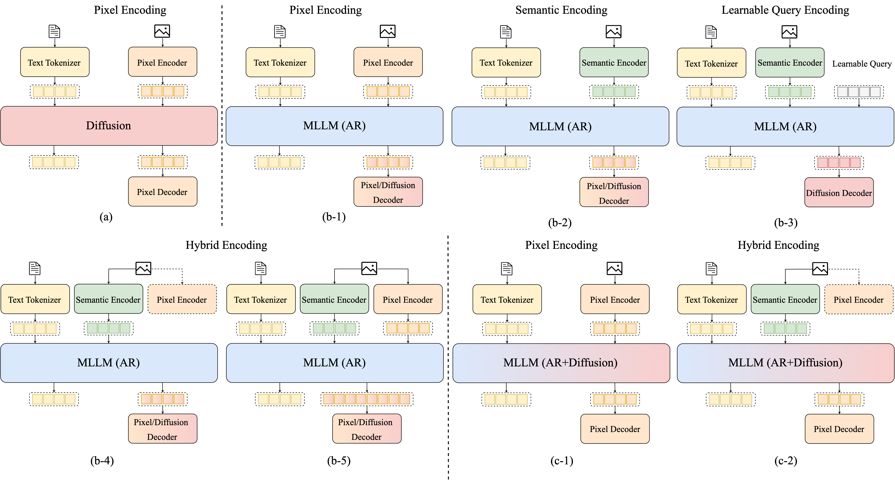

<div align="center">
  
<p>
  
</p>

# Awesome Multimodal Modeling 
<p><strong>A Comprehensive Survey & Curated List of Multimodal Modeling</strong><br/><sub>From Traditional Fusion to Native & Unified Architectures</sub></p>

<p>
  <a href="https://awesome.re"></a>
  <a href="https://github.com/OpenEnvision-Lab/Awesome-Multimodal-Model-Traditional-Advanced/pulls"></a>
  
  
  
</p>

<p>
  <a href="#1-introduction--definitions"></a>
  <a href="#2-traditional-multimodal-models"></a>
  <a href="#3-multimodal-large-language-models-mllms"></a>
  <a href="#4-unified-multimodal-models-umms"></a>
  <a href="#5-native-multimodal-models-nmms"></a>
  <a href="#6-closed-source-multimodal-models"></a>
  <a href="#7-resources"></a>
</p>

<p><sub><a href="#1-introduction-definitions">Overview</a> · <a href="#2-traditional-multimodal-models">Traditional</a> · <a href="#3-multimodal-large-language-models-mllms">MLLMs</a> · <a href="#4-unified-multimodal-models-umms">UMMs</a> · <a href="#5-native-multimodal-models-nmms">NMMs</a> ·<a href="#6-closed-source-multimodal-models">Closed Source Models</a> · <a href="#7-resources">Resources</a></sub></p>

</div>

## 📢 News

- **[2026-04-19]** ⭐ The repository has quickly gained **250+ stars**!
- **[2026-04-13]** ⭐ The repository has already gained **over 100 stars** in just one day! Thank you all for the incredible support. We will keep updating this list with more cutting-edge models and resources. **Your continued stars and PRs are warmly welcomed!**
- **[2026-04-12]** 🎉 We are excited to launch **Awesome Multimodal Modeling** — a curated reading list organized by architectural paradigms. A comprehensive survey paper is coming soon! Stay tuned.

## Table of Contents

<details open>
<summary><strong>Browse the list</strong></summary>

- [Awesome Multimodal Modeling](#awesome-multimodal-modeling)
  - [📢 News](#-news)
  - [Table of Contents](#table-of-contents)
  - [About This List](#about-this-list)
    - [At a Glance](#at-a-glance)
    - [Curation Principles](#curation-principles)
  - [1. Introduction \& Definitions](#1-introduction--definitions)
    - [1.1 Multimodal Model Evolution Stages](#11-multimodal-model-evolution-stages)
      - [Traditional Multimodal Models](#traditional-multimodal-models)
      - [Multimodal Large Language Models (MLLMs)](#multimodal-large-language-models-mllms)
      - [Unified Multimodal Models (UMMs)](#unified-multimodal-models-umms)
      - [Native Multimodal Models (NMMs)](#native-multimodal-models-nmms)
        - [NMM — Early Fusion](#nmm--early-fusion)
        - [NMM — Late Fusion](#nmm--late-fusion)
    - [1.2 Scope \& Taxonomy](#12-scope--taxonomy)
    - [1.3 Architecture Diagrams](#13-architecture-diagrams)
  - [2. Traditional Multimodal Models](#2-traditional-multimodal-models)
    - [2.1 Multimodel Representations \& Alignment](#21-multimodel-representations--alignment)
      - [Multimodal Representations](#multimodal-representations)
      - [Multimodal Fusion](#multimodal-fusion)
      - [Multimodal Alignment](#multimodal-alignment)
    - [2.2 Multimodal Pretraining](#22-multimodal-pretraining)
  - [3. Multimodal Large Language Models (MLLMs)](#3-multimodal-large-language-models-mllms)
    - [3.1 Taxonomy Based on Vision Adapter](#31-taxonomy-based-on-vision-adapter)
      - [MLP/Others Projector](#mlpothers-projector)
      - [Q-Former](#q-former)
      - [Cross-Attention](#cross-attention)
      - [Hybrid Adaptor](#hybrid-adaptor)
    - [3.2 Omni MLLMs](#32-omni-mllms)
  - [4. Unified Multimodal Models (UMMs)](#4-unified-multimodal-models-umms)
    - [4.1 Taxonomy by Generation Paradigm](#41-taxonomy-by-generation-paradigm)
      - [Diffusion-Based UMMs](#diffusion-based-umms)
      - [Autoregressive (AR) UMMs](#autoregressive-ar-umms)
        - [Pixel Encoding](#pixel-encoding)
        - [Semantic Encoding](#semantic-encoding)
        - [Learnable Query Encoding](#learnable-query-encoding)
        - [Hybrid Encoding (Pseduo)](#hybrid-encoding-pseduo)
        - [Hybrid Encoding (Joint)](#hybrid-encoding-joint)
      - [Hybrid (AR + Diffusion) UMMs](#hybrid-ar--diffusion-umms)
        - [Pixel Encoding](#pixel-encoding-1)
        - [Hybrid Encoding](#hybrid-encoding)
    - [4.2 Any-to-Any / Omni UMMs](#42-any-to-any--omni-umms)
  - [5. Native Multimodal Models (NMMs)](#5-native-multimodal-models-nmms)
    - [5.1 Design Analyses \& Scaling Laws](#51-design-analyses--scaling-laws)
    - [5.2 Early Fusion NMMs](#52-early-fusion-nmms)
    - [5.3 Late Fusion NMMs](#53-late-fusion-nmms)
    - [5.4 Any-to-Any / Omni NMMs](#54-any-to-any--omni-nmms)
  - [6. Closed-Source Multimodal Models](#6-closed-source-multimodal-models)
    - [Year 2026](#year-2026)
    - [Year 2025](#year-2025)
    - [Year 2024](#year-2024)
    - [Year 2023](#year-2023)
  - [7. Resources](#7-resources)
    - [7.1 Related Awesome Lists](#71-related-awesome-lists)
    - [7.2 Slides \& Survey Papers](#72-slides--survey-papers)
    - [7.3 Code Repositories \& Tools](#73-code-repositories--tools)
  - [How to Contribute](#how-to-contribute)
    - [Validation Rules](#validation-rules)
    - [Entry Format](#entry-format)
  - [Citation](#citation)
  - [License](#license)

</details>

## About This List

**In this section:** [At a Glance](#at-a-glance) · [Curation Principles](#curation-principles)

This repository provides a **structured, community-maintained** survey of multimodal models, covering the full evolutionary arc from early fusion methods to today's natively-trained omni-models. We emphasize **precise architectural definitions** and classification, especially for the often-conflated categories of Unified Multimodal Models (UMMs) and Native Multimodal Models (NMMs).

> **Scope**: Primary focus on **image + text** modalities; audio/video/3D are annotated where present. Omni/any-to-any models are marked with <kbd>Omni</kbd>.

### At a Glance

| Dimension | Coverage |
|---|---|
| Primary scope | Image + text multimodal models, with explicit annotations for video, audio, and omni extensions |
| Core taxonomy | Traditional multimodal models, MLLMs, UMMs, and strict NMMs |
| Key distinction | `U+G unification` for UMMs vs. `joint training from scratch` for NMMs |
| What makes this repo different | Architecture-first categorization, fusion-aware definitions, and curated links to adjacent awesome lists |
| Intended audience | Researchers, students, and engineers building or surveying multimodal systems |

### Curation Principles

| Principle | Rule |
|---|---|
| Source quality | Prefer official conference proceedings, OpenReview, ACL Anthology, CVF Open Access, arXiv, and official project pages |
| Classification policy | Category assignment is based on this repository's **architecture-first definitions**, which may differ from authors' own branding |
| Venue policy | If a peer-reviewed venue is known, we list that venue; otherwise we keep the entry as `arXiv` |
| Scope discipline | Models, benchmarks, datasets, and analysis papers are tracked separately to avoid mixing artifacts |
| Inclusion bar | We prioritize landmark papers, broadly adopted benchmarks, open implementations, or papers that clarify important taxonomy boundaries |

> Classification note: for ambiguous models sitting between `MLLM`, `UMM`, and strict `NMM`, this list records the category that best matches the **training recipe and architectural coupling**, not just the paper title.

<p align="right"><a href="#awesome-multimodal-modeling">Back to Top</a></p>

---

## 1. Introduction & Definitions

**In this section:** [1.1 Multimodal Model Evolution Stages](#11-multimodal-model-evolution-stages) · [1.2 Scope & Taxonomy](#12-scope-taxonomy) · [1.3 Architecture Diagrams](#13-architecture-diagrams)

### 1.1 Multimodal Model Evolution Stages

**Subtopics:** [Traditional Multimodal Models](#traditional-multimodal-models) · [Multimodal Large Language Models (MLLMs)](#multimodal-large-language-models-mllms) · [Unified Multimodal Models (UMMs)](#unified-multimodal-models-umms) · [Native Multimodal Models (NMMs)](#native-multimodal-models-nmms)

We use the following **precise, architecture-first definitions** throughout this list. Understanding these distinctions is critical for correctly classifying modern models.

#### Traditional Multimodal Models

 
> *Pre-2023 mainstream era*

Independent per-modality processing followed by simple fusion (early, late, or hybrid). No large-scale language model backbone. Focuses on representation alignment, cross-modal retrieval, and captioning. Examples: CLIP, ALIGN, ViLBERT, BLIP.

#### Multimodal Large Language Models (MLLMs)

 
> *Pretrained-backbone multimodal language models*

Combine a **pretrained visual backbone or visual abstractor** (e.g., ViT/CLIP/SigLIP, Q-Former, cross-attention adapter) with a **pretrained LLM** through a connector. The defining property is inheritance from strong pretrained unimodal backbones rather than joint multimodal pretraining from scratch. These models are primarily **text-output understanding/reasoning systems**, even when auxiliary generators are attached externally.

Key characteristics:
- ✅ Pretrained visual encoder / abstractor
- ✅ Pretrained LLM backbone
- ✅ Connector layer or cross-attention bridge
- ❌ No end-to-end multimodal pretraining from scratch
- ❌ No native image generation inside the same backbone

Examples: **LLaVA**, **Qwen-VL**, **InternVL**, **MiniCPM-V**, **CogVLM**

#### Unified Multimodal Models (UMMs)

 
> *Single framework for Understanding + Generation (U+G)*

A **single framework** that handles both multimodal understanding and visual generation. UMMs may reuse pretrained components or modular tokenizers; the defining feature is **U+G unification**, not whether the model is trained from scratch.

Key characteristics:
- ✅ Unified understanding + generation
- ✅ Shared model interface or shared backbone for U+G
- ⚠️ May use pretrained components
- ⚠️ May use decoupled encoders / modular tokenizers
- ⚠️ If a model is also natively trained from scratch, its architectural details belong primarily in **NMMs (§5)**

Examples: **Show-o**, **Janus**, **OpenUni**, **BAGEL**, **BLIP3-o**

#### Native Multimodal Models (NMMs)

 
> *Jointly trained from scratch — no pretrained backbone*

**The strictest category.** NMMs are trained **jointly from scratch on all modalities** — they do **not** rely on any pretrained LLM or pretrained vision encoder as initialization. All parameters are learned end-to-end from raw multimodal data.

Key characteristics:
- ✅ No pretrained LLM backbone
- ✅ No pretrained vision encoder
- ✅ All components jointly trained from scratch
- ✅ Input: text tokens + image patches/tokens
- ✅ Output: text (understanding focus; generation optional)

NMMs are further divided by **fusion architecture**:

##### NMM — Early Fusion
Multimodal interaction begins **from the first layer**. A **single Transformer decoder** processes tokenized text and continuous/discrete image patches together, with **minimal modality-specific parameters** (only a linear patchify layer for images). No separate image encoder is maintained.

- Single unified Transformer (decoder-only)
- Continuous image patches or minimal discrete tokenization
- Modality interaction from layer 1
- Near-zero modality-specific parameters (excluding linear patch embed)
- Examples: **Emu3** (if trained from scratch)

##### NMM — Late Fusion
Each modality is first processed by a **dedicated unimodal component** (e.g., a vision tower or image encoder), but these components are **jointly trained from scratch** (not pretrained). Cross-modal interaction occurs at **deeper layers**.

- Separate unimodal processing stages (trained from scratch)
- Cross-modal interaction at deeper layers
- More modality-specific parameters
- Examples: Models with jointly-trained vision encoders → decoder interaction

### 1.2 Scope & Taxonomy

```text
Multimodal Models
├── 2. Traditional Multimodal Models
│   ├── 2.1 Multimodel Representations & Alignment
│   │   ├── Multimodal Representations
│   │   ├── Multimodal Fusion
│   │   └── Multimodal Alignment
│   └── 2.2 Multimodal Pretraining
├── 3. Multimodal Large Language Models (MLLMs)
│   ├── 3.1 Foundation MLLMs
│   └── 3.2 Omni MLLMs
├── 4. Unified Multimodal Models (UMMs)
│   ├── 4.1 Taxonomy by Generation Paradigm
│   │   ├── Diffusion-Based UMMs
│   │   ├── Autoregressive (AR) UMMs
│   │   │   ├── Pixel Encoding
│   │   │   ├── Semantic Encoding
│   │   │   ├── Learnable Query Encoding
│   │   │   ├── Hybrid Encoding (Pseduo)
│   │   │   └── Hybrid Encoding (Joint)
│   │   └── Hybrid (AR + Diffusion) UMMs
│   │       ├── Pixel Encoding
│   │       └── Hybrid Encoding
│   └── 4.2 Any-to-Any / Omni UMMs
└── 5. Native Multimodal Models (NMMs)
    ├── 5.1 Design Analyses & Scaling Laws
    ├── 5.2 Early Fusion NMMs
    ├── 5.3 Late Fusion NMMs
    └── 5.4 Any-to-Any / Omni NMMs
```

### 1.3 Architecture Diagrams

```
┌─────────────────────────────────────────────────────────────────┐
│           TRADITIONAL MULTIMODAL MODEL                          │
│                                                                 │
│  [Image] ──► [CNN/ViT Encoder] ──┐                              │
│                                  ├──► [Fusion] ──► [Output]     │
│  [Text]  ──► [LSTM/BERT]       ──┘                              │
└─────────────────────────────────────────────────────────────────┘

┌─────────────────────────────────────────────────────────────────┐
│           MLLM — MODULAR LATE FUSION                            │
│                                                                 │
│  [Image] ──► [Pretrained ViT/CLIP] ──► [Projector/Q-Former]     │
│                                                │                │
│                                                ▼                │
│  [Text]  ──────────────────────────► [Pretrained LLM] ──► [Text]│
└─────────────────────────────────────────────────────────────────┘

┌─────────────────────────────────────────────────────────────────┐
│           UMM — UNIFIED UNDERSTANDING + GENERATION              │
│                                                                 │
│  [Image/Text Input] ──► [Shared/Modular Tokenizer]              │
│                                │                                │
│                                ▼                                │
│                   [Unified Transformer]                         │
│                       │           │                             │
│                       ▼           ▼                             │
│             [Text Output]      [Image Output]                   │
└─────────────────────────────────────────────────────────────────┘

┌─────────────────────────────────────────────────────────────────┐
│           NMM — EARLY FUSION (Trained from Scratch)             │
│                                                                 │
│  [Text tokens] ──┐                                              │
│                  └──► [Single Decoder Transformer] ──► [Text]   │
│  [Image patches ──► Linear Patchify] ──┘                        │
│   (raw pixels, minimal preprocessing)                           │
│   Multimodal interaction from Layer 1                           │
└─────────────────────────────────────────────────────────────────┘

┌─────────────────────────────────────────────────────────────────┐
│           NMM — LATE FUSION (Trained from Scratch)              │
│                                                                 │
│  [Image] ──► [Jointly-Trained Vision Component]                 │
│                         │                                       │
│                         ▼  (deep layers)                        │
│  [Text]  ──────────► [Cross-Modal Interaction] ──► [Text]       │
│           (All components trained jointly from scratch)         │
└─────────────────────────────────────────────────────────────────┘
```

<p align="right"><a href="#awesome-multimodal-modeling">Back to Top</a></p>

---

## 2. Traditional Multimodal Models

**In this section:** [2.1 Multimodel Representations & Alignment](#21-multimodel-representations-alignment) · [2.2 Multimodal Pretraining](#22-multimodal-pretraining)

> Pre-chat-MLLM and non-native multimodal systems that established the basic vocabulary of alignment, fusion, retrieval, captioning, and multimodal pretraining.

### 2.1 Multimodel Representations & Alignment

**Subtopics:** [Multimodal Representations](#multimodal-representations) · [Multimodal Fusion](#multimodal-fusion) · [Multimodal Alignment](#multimodal-alignment)

#### Multimodal Representations

| Paper | Venue | Links | Notes | Task |
|---|---|---|---|---|
| Identifiability Results for Multimodal Contrastive Learning | ICLR 2023 | [Paper](https://arxiv.org/abs/2303.09166) | Theoretical identifiability analysis of contrastive multimodal learning | representation learning |
| Unpaired Vision-Language Pre-training via Cross-Modal CutMix | ICML 2022 | [Paper](https://arxiv.org/abs/2206.08919) | Introduces CutMix-style augmentation for unpaired VLP | vision-language pretraining |
| Balanced Multimodal Learning via On-the-fly Gradient Modulation | CVPR 2022 | [Paper](https://arxiv.org/abs/2203.15332) | Balances modality learning via dynamic gradient reweighting | multimodal optimization |
| Unsupervised Voice-Face Representation Learning by Cross-Modal Prototype Contrast | IJCAI 2021 | [Paper](https://arxiv.org/abs/2106.15080) | Cross-modal prototype contrast for voice-face alignment | audio-visual representation learning |
| Towards a Unified Foundation Model: Jointly Pre-Training Transformers on Unpaired Images and Text | arXiv 2021 | [Paper](https://arxiv.org/abs/2107.10314) | Early unified transformer for unpaired multimodal pretraining | unified multimodal pretraining |
| FLAVA: A Foundational Language And Vision Alignment Model | arXiv 2021 | [Paper](https://arxiv.org/abs/2112.04482) | Unified architecture for vision-language understanding and generation | foundation multimodal model |
| Transformer is All You Need: Multimodal Multitask Learning with a Unified Transformer | arXiv 2021 | [Paper](https://arxiv.org/abs/2106.03161) | Single transformer for multiple multimodal tasks | multimodal multitask learning |
| MultiBench: Multiscale Benchmarks for Multimodal Representation Learning | NeurIPS 2021 | [Paper](https://arxiv.org/abs/2107.07502) | Benchmark suite for multimodal learning evaluation | benchmarking |
| Perceiver: General Perception with Iterative Attention | ICML 2021 | [Paper](https://arxiv.org/abs/2103.03206) | General-purpose architecture for high-dimensional multimodal inputs | general multimodal architecture |
| Learning Transferable Visual Models From Natural Language Supervision | arXiv 2021 | [Paper](https://arxiv.org/abs/2103.00020) | Contrastive vision-language pretraining at scale | vision-language contrastive learning |
| VinVL: Revisiting Visual Representations in Vision-Language Models | arXiv 2021 | [Paper](https://arxiv.org/abs/2101.00529) | Improved visual features for VL tasks | vision-language representation improvement |
| Learning Transferable Visual Models From Natural Language Supervision | arXiv 2020 | [Paper](https://arxiv.org/abs/2103.00020) | Early large-scale vision-language contrastive learning | vision-language pretraining |
| 12-in-1: Multi-Task Vision and Language Representation Learning | CVPR 2020 | [Paper](https://arxiv.org/abs/1912.02315) | Unified multi-task learning across 12 VL tasks | multi-task learning |
| Watching the World Go By: Representation Learning from Unlabeled Videos | arXiv 2020 | [Paper](https://arxiv.org/abs/2003.07918) | Self-supervised video representation learning | video representation learning |
| Learning Video Representations using Contrastive Bidirectional Transformer | arXiv 2019 | [Paper](https://arxiv.org/abs/1906.05743) | Contrastive transformer for video representation learning | video contrastive learning |
| Visual Concept-Metaconcept Learning | NeurIPS 2019 | [Paper](https://arxiv.org/abs/1906.04351) | Hierarchical concept learning from visual data | concept learning |
| OmniNet: A Unified Architecture for Multi-modal Multi-task Learning | arXiv 2019 | [Paper](https://arxiv.org/abs/1907.07804) | Unified encoder-decoder for multimodal tasks | unified multimodal architecture |
| Learning Representations by Maximizing Mutual Information Across Views | arXiv 2019 | [Paper](https://arxiv.org/abs/1906.00910) | InfoMax principle for cross-view representation learning | self-supervised learning |
| ViCo: Word Embeddings from Visual Co-occurrences | ICCV 2019 | [Paper](https://arxiv.org/abs/1908.08535) | Learning word embeddings from visual context | vision-language embeddings |
| Unified Visual-Semantic Embeddings: Bridging Vision and Language With Structured Meaning Representations | CVPR 2019 | [Paper](https://arxiv.org/abs/1812.03508) | Structured embedding space for vision-language alignment | embedding learning |
| Multi-Task Learning of Hierarchical Vision-Language Representation | CVPR 2019 | [Paper](https://arxiv.org/abs/1811.07865) | Hierarchical representation learning across VL tasks | multi-task learning |
| Learning Factorized Multimodal Representations | ICLR 2019 | [Paper](https://arxiv.org/abs/1806.06176) | Factorized latent space for multimodal data | representation disentanglement |
| A Probabilistic Framework for Multi-view Feature Learning with Many-to-many Associations via Neural Networks | ICML 2018 | [Paper](https://arxiv.org/abs/1806.00092) | Probabilistic modeling of multi-view correspondence | multi-view learning |
| Do Neural Network Cross-Modal Mappings Really Bridge Modalities? | ACL 2018 | [Paper](https://arxiv.org/abs/1810.07676) | Analyzes limitations of cross-modal mapping | theoretical analysis |
| Learning Robust Visual-Semantic Embeddings | ICCV 2017 | [Paper](https://arxiv.org/abs/1703.08604) | Improved robustness in vision-language embeddings | embedding learning |
| Deep Multimodal Representation Learning from Temporal Data | CVPR 2017 | [Paper](https://arxiv.org/abs/1704.03126) | Temporal multimodal representation learning | multimodal temporal learning |
| Is an Image Worth More than a Thousand Words? On the Fine-Grain Semantic Differences between Visual and Linguistic Representations | COLING 2016 | [Paper](https://arxiv.org/abs/1608.03244) | Analyzes semantic gap between vision and language | representation analysis |
| Combining Language and Vision with a Multimodal Skip-gram Model | NAACL 2015 | [Paper](https://arxiv.org/abs/1411.4009) | Extends skip-gram with visual context | multimodal embeddings |
| Deep Fragment Embeddings for Bidirectional Image Sentence Mapping | NeurIPS 2014 | [Paper](https://arxiv.org/abs/1406.5679) | Fragment-level image-sentence alignment | vision-language alignment |
| Multimodal Deep Learning | JMLR 2014 | [Paper](https://arxiv.org/abs/1206.5538) | Probabilistic generative multimodal model | generative multimodal learning |
| Learning Grounded Meaning Representations with Autoencoders | ACL 2014 | [Paper](https://arxiv.org/abs/1406.5299) | Autoencoder-based grounded semantics | representation learning |
| DeViSE: A Deep Visual-Semantic Embedding Model | NeurIPS 2013 | [Paper](https://arxiv.org/abs/1312.5650) | Early deep vision-to-language embedding model | vision-language embedding |
| Multimodal Deep Learning | ICML 2011 | [Paper](https://arxiv.org/abs/1206.5538) | Foundational multimodal deep learning framework | multimodal deep learning |

#### Multimodal Fusion

| Paper | Venue | Links | Notes | Task |
|---|---|---|---|---|
| Robust Contrastive Learning against Noisy Views | arXiv 2022 | [Paper](https://arxiv.org/abs/2201.04309) | Robust contrastive learning under noisy multi-view inputs | contrastive learning |
| Cooperative Learning for Multi-view Analysis | arXiv 2022 | [Paper](https://arxiv.org/abs/2201.11032) | Cooperative optimization across multiple views for representation learning | multi-view learning |
| What Makes Multi-modal Learning Better than Single (Provably) | NeurIPS 2021 | [Paper](https://arxiv.org/abs/2106.11028) | Theoretical guarantees showing when multimodal learning improves over unimodal | theoretical analysis |
| Efficient Multi-Modal Fusion with Diversity Analysis | ACMMM 2021 | [Paper](https://arxiv.org/abs/2106.05711) | Fusion method emphasizing diversity-aware multimodal integration | multimodal fusion |
| Attention Bottlenecks for Multimodal Fusion | NeurIPS 2021 | [Paper](https://arxiv.org/abs/2107.00135) | Introduces bottleneck attention mechanism for efficient multimodal fusion | multimodal fusion |
| VMLoc: Variational Fusion For Learning-Based Multimodal Camera Localization | AAAI 2021 | [Paper](https://arxiv.org/abs/2009.07690) | Variational multimodal fusion for camera localization tasks | multimodal localization |
| Trusted Multi-View Classification | ICLR 2021 | [Paper](https://arxiv.org/abs/2102.02051) | Confidence-aware weighting for multi-view classification | multi-view classification |
| Deep-HOSeq: Deep Higher-Order Sequence Fusion for Multimodal Sentiment Analysis | ICDM 2020 | [Paper](https://arxiv.org/abs/2006.07202) | Higher-order sequence fusion for multimodal sentiment analysis | multimodal sentiment analysis |
| Removing Bias in Multi-modal Classifiers: Regularization by Maximizing Functional Entropies | NeurIPS 2020 | [Paper](https://arxiv.org/abs/2006.08516) | Entropy-based regularization to reduce modality bias | multimodal fairness/robustness |
| Deep Multimodal Fusion by Channel Exchanging | NeurIPS 2020 | [Paper](https://arxiv.org/abs/2010.14757) | Channel exchange mechanism for cross-modal feature interaction | multimodal fusion |
| What Makes Training Multi-Modal Classification Networks Hard? | CVPR 2020 | [Paper](https://arxiv.org/abs/1905.12681) | Analyzes optimization challenges in multimodal classification | theoretical/empirical analysis |
| Dynamic Fusion for Multimodal Data | arXiv 2019 | [Paper](https://arxiv.org/abs/1904.08039) | Adaptive fusion strategy depending on input modality quality | multimodal fusion |
| DeepCU: Integrating Both Common and Unique Latent Information for Multimodal Sentiment Analysis | IJCAI 2019 | [Paper](https://arxiv.org/abs/1904.02289) | Separates shared and private latent representations for fusion | multimodal sentiment analysis |
| Deep Multimodal Multilinear Fusion with High-order Polynomial Pooling | NeurIPS 2019 | [Paper](https://arxiv.org/abs/1906.04155) | High-order tensor/polynomial fusion for multimodal features | multimodal fusion |
| XFlow: Cross-modal Deep Neural Networks for Audiovisual Classification | IEEE TNNLS 2019 | [Paper](https://arxiv.org/abs/1809.02190) | Cross-modal feature exchange network for audio-visual tasks | audio-visual classification |
| MFAS: Multimodal Fusion Architecture Search | CVPR 2019 | [Paper](https://arxiv.org/abs/1804.00139) | Neural architecture search for optimal multimodal fusion design | architecture search |
| The Neuro-Symbolic Concept Learner: Interpreting Scenes, Words, and Sentences From Natural Supervision | ICLR 2019 | [Paper](https://arxiv.org/abs/1904.12584) | Neuro-symbolic model combining perception and reasoning | neuro-symbolic learning |
| Unifying and merging well-trained deep neural networks for inference stage | IJCAI 2018 | [Paper](https://arxiv.org/abs/1805.10680) | Model merging strategy for inference-time multimodal integration | model fusion |
| Efficient Low-rank Multimodal Fusion with Modality-Specific Factors | ACL 2018 | [Paper](https://arxiv.org/abs/1806.00064) | Low-rank factorization for efficient multimodal fusion | efficient fusion |
| Memory Fusion Network for Multi-view Sequential Learning | AAAI 2018 | [Paper](https://arxiv.org/abs/1802.00927) | Memory-based fusion across temporal multimodal sequences | sequential multimodal learning |
| Tensor Fusion Network for Multimodal Sentiment Analysis | EMNLP 2017 | [Paper](https://arxiv.org/abs/1707.07250) | Tensor-based full interaction modeling across modalities | multimodal sentiment analysis |
| Jointly Modeling Deep Video and Compositional Text to Bridge Vision and Language in a Unified Framework | AAAI 2015 | [Paper](https://arxiv.org/abs/1502.01092) | Joint modeling of video and compositional language | vision-language modeling |
| A co-regularized approach to semi-supervised learning with multiple views | ICML 2005 | [Paper](https://arxiv.org/abs/1206.5538) | Early multi-view co-regularization framework | multi-view semi-supervised learning |

#### Multimodal Alignment

| Paper | Venue | Links | Notes | Task |
|---|---|---|---|---|
| CLIP | arXiv 2021 | [Paper](https://arxiv.org/abs/2103.00020) | 400M+ | Dual-encoder (Vision Transformer + Text Transformer); contrastive alignment at embedding level; classic late-fusion foundation | zero-shot image classification, retrieval |
| Reconsidering Representation Alignment for Multi-view Clustering | CVPR 2021 | [Paper](https://arxiv.org/abs/2103.04291) | Revisits representation alignment objectives for multi-view clustering | multimodal alignment |
| CoMIR: Contrastive Multimodal Image Representation for Registration | NeurIPS 2020 | [Paper](https://arxiv.org/abs/2006.06325) | Contrastive learning for multimodal image registration alignment | multimodal alignment |
| Multimodal Transformer for Unaligned Multimodal Language Sequences | ACL 2019 | [Paper](https://arxiv.org/abs/1906.00295) | Transformer-based alignment for unaligned multimodal sequences | sequence alignment |
| Temporal Cycle-Consistency Learning | CVPR 2019 | [Paper](https://arxiv.org/abs/1904.07846) | Uses cycle-consistency for temporal cross-modal alignment | temporal alignment |
| See, Hear, and Read: Deep Aligned Representations | arXiv 2017 | [Paper](https://arxiv.org/abs/1706.08681) | Learns aligned representations across vision, audio, and text | multimodal alignment |
| On Deep Multi-View Representation Learning | ICML 2015 | [Paper](https://arxiv.org/abs/1502.04183) | Theoretical and empirical study of multi-view representation alignment | multi-view learning |
| Unsupervised Alignment of Natural Language Instructions with Video Segments | AAAI 2014 | [Paper](https://arxiv.org/abs/1403.0613) | Aligns language instructions with video segments without supervision | language-video alignment |
| Multimodal Alignment of Videos | ACM MM 2014 | [Paper](https://arxiv.org/abs/1405.2389) | Early multimodal alignment framework for video modalities | video alignment |
| Deep Canonical Correlation Analysis | ICML 2013 | [Paper](https://arxiv.org/abs/1306.2718) | Deep learning extension of CCA for cross-view representation alignment | representation alignment |

### 2.2 Multimodal Pretraining

| Paper | Venue | Links | Notes | Task |
|---|---|---|---|---|
| Align before Fuse: Vision and Language Representation Learning with Momentum Distillation | NeurIPS 2021 Spotlight | [Paper](https://arxiv.org/abs/2107.07651) | Momentum distillation for aligning vision-language representations before fusion | vision-language pretraining |
| Less is More: ClipBERT for Video-and-Language Learning via Sparse Sampling | CVPR 2021 | [Paper](https://arxiv.org/abs/2102.06183) | Sparse frame sampling for efficient video-language pretraining | video-language pretraining |
| Transformer is All You Need: Multimodal Multitask Learning with a Unified Transformer | arXiv 2021 | [Paper](https://arxiv.org/abs/2102.10772) | Unified transformer for multitask multimodal learning | unified multimodal pretraining |
| Large-Scale Adversarial Training for Vision-and-Language Representation Learning | NeurIPS 2020 | [Paper](https://arxiv.org/abs/2006.06195) | Adversarial training improves robustness of vision-language representations | robust multimodal pretraining |
| Vokenization: Improving Language Understanding with Contextualized, Visual-Grounded Supervision | EMNLP 2020 | [Paper](https://arxiv.org/abs/2010.06775) | Grounds language tokens in visual context via voken supervision | vision-grounded language modeling |
| Integrating Multimodal Information in Large Pretrained Transformers | ACL 2020 | [Paper](https://arxiv.org/abs/1908.05787) | Injects multimodal signals into large pretrained transformer architectures | multimodal transformer pretraining |
| VL-BERT: Pre-training of Generic Visual-Linguistic Representations | arXiv 2019 | [Paper](https://arxiv.org/abs/1908.08530) | Joint vision-language BERT-style pretraining | vision-language pretraining |
| VisualBERT: A Simple and Performant Baseline for Vision and Language | arXiv 2019 | [Paper](https://arxiv.org/abs/1908.03557) | Early unified transformer for vision-language understanding | vision-language pretraining |
| ViLBERT: Pretraining Task-Agnostic Visiolinguistic Representations for Vision-and-Language Tasks | NeurIPS 2019 | [Paper](https://arxiv.org/abs/1908.02265) | Two-stream transformer for cross-modal vision-language learning | vision-language pretraining |
| Unicoder-VL: A Universal Encoder for Vision and Language by Cross-modal Pre-training | arXiv 2019 | [Paper](https://arxiv.org/abs/1908.06066) | Cross-modal encoder for universal vision-language representations | vision-language pretraining |
| LXMERT: Learning Cross-Modality Encoder Representations from Transformers | EMNLP 2019 | [Paper](https://arxiv.org/abs/1908.07490) | Cross-modality transformer encoder for vision-language reasoning | vision-language pretraining |
| VideoBERT: A Joint Model for Video and Language Representation Learning | ICCV 2019 | [Paper](https://arxiv.org/abs/1904.01766) | Joint discrete token modeling for video and language | video-language pretraining |

<p align="right"><a href="#awesome-multimodal-modeling">Back to Top</a></p>

---

## 3. Multimodal Large Language Models (MLLMs)

**In this section:** [3.1 Foundation MLLMs](#31-foundation-mllms) · [3.2 Omni MLLMs](#32-omni-mllms)

> Models that connect a **pretrained visual encoder / abstractor** to a **pretrained LLM**. Primarily text-output understanding and reasoning systems, defined by inherited pretrained unimodal backbones rather than multimodal pretraining from scratch.

### 3.1 Taxonomy Based on Vision Adapter

#### MLP/Others Projector

| Paper | Venue | Links | Notes | Task |
|---|---|---|---|---|
| Penguin-VL: Exploring the Efficiency Limits of VLM with LLM-based Vision Encoders | arXiv 2026 | [Paper](https://arxiv.org/pdf/2603.06569) | LLM-initialized vision encoder (non-CLIP); text-to-vision weight reuse, generative-aligned visual features, optimized for dense perception. | visual understanding |
| Youtu-VL: Unleashing Visual Potential via Unified Vision-Language Supervision | arXiv 2026 | [Paper](https://arxiv.org/abs/2601.19798) | Tri-modal (V+A+L) unified framework; parameter-efficient tuning, seamless cross-modal reasoning for mobile/IoT deployment. | visual understanding |
| STEP3-VL-10B Technical Report | arXiv 2026 | [Paper](https://arxiv.org/pdf/2601.09668) | 10B-scale foundation multimodal; unified unfrozen pre-training + PaCoRe test-time scaling, frontier-level reasoning with compact footprint. | visual understanding |
| GLM-OCR | arXiv 2026 | [Paper](https://arxiv.org/abs/2603.10910) | GLM-OCR is an efficient 0.9B-parameter compact multimodal model designed for real-world document understanding. | OCR, structured extraction |
| Kimi K2.5 | arXiv 2026 | [Paper](https://arxiv.org/abs/2602.02276) | joint text-vision pretraining, Agent Swarm framework; coding, vision, reasoning, agentic tasks; reduces latency by up to 4.5x | visual agentic intelligence, agentic, reasoning |
| Kwai Keye-VL 1.5 Technical Report | arXiv 2025 | [Paper](https://arxiv.org/pdf/2509.01563) | Adaptive Slow-Fast encoding; 8B parameter scale with 128K long-context; SOTA video reasoning & human-preference aligned. | visual understanding |
| olmOCR / olmOCR-2 | arXiv 2025 | [Paper](https://arxiv.org/abs/2510.19817) | Efficient low-VRAM OCR model based on Qwen2.5-VL fine-tune; excels at preserving semantic structure and markdown output | OCR, structured extraction |
| PaddleOCR-VL | arXiv 2025 | [HF / Official](https://github.com/PaddlePaddle/PaddleOCR) | Lightweight (0.9B+) multimodal OCR with 109 languages support; excellent chart-to-HTML/Markdown conversion and high-throughput | OCR, multilingual document |
| DeepSeek-OCR | arXiv 2025 | [Paper](https://arxiv.org/abs/2510.18234) [HF](https://huggingface.co/deepseek-ai) | Lightweight ~3B MoE vision model optimized for high-volume OCR, document digitization, charts and formulas; efficient inference | OCR, document |
| Kimi-VL | arXiv 2025 | [Paper](https://arxiv.org/abs/2504.07491) [HF](https://huggingface.co/moonshotai/Kimi-VL-A3B-Thinking)  | Projector + MoE backbone; long video/PDF/GUI, agentic capabilities, chain-of-thought vision reasoning | visual understanding, agentic, video |
| Seed1.5-VL Technical Report | arXiv 2025 | [Paper](https://arxiv.org/pdf/2505.07062) | 20B MoE + 532M ViT; native-resolution vision-language foundation model; efficient asymmetric architecture. | visual understanding |
| Qwen3-VL | arXiv 2025 | [Paper](https://arxiv.org/abs/2511.21631) [HF](https://huggingface.co/Qwen)  | Frontier-grade vision/OCR (32+ languages), video analysis, agentic capabilities, strong multimodal reasoning; includes large MoE variants (e.g., 235B) | visual understanding, video, omni |
| SmolVLM | arXiv 2025 | [HF](https://huggingface.co/HuggingFaceTB/SmolVLM-256M)  | Ultra-lightweight (256M–2.2B) projector-based series; efficient on-device video and image understanding | visual understanding, efficiency |
| LLaDA-V: Large Language Diffusion Models with Visual Instruction Tuning | arXiv 2025 | [Paper](https://arxiv.org/pdf/2505.16933) | Diffusion llm as llm backbone; Vision encoder: Siglip | visual understanding |
| jina-vlm | arXiv 2025 | [Paper](https://arxiv.org/abs/2512.04032) [HF](https://huggingface.co/jinaai/jina-vlm)  | SigLIP2 + Qwen backbone with custom projector; optimized for semantic VQA, diagrams, scans and document semantics | visual understanding, VQA, document |
| Phi-4-Multimodal | arXiv 2025 | [Paper](https://arxiv.org/abs/2503.01743) [HF](https://huggingface.co/microsoft/Phi-4-multimodal)  | Small-parameter (LoRA + projectors) multimodal; vision + speech support, efficient on-device deployment | visual understanding, on-device |
| Molmo / PixMo | CVPR 2025 | [Paper](https://openaccess.thecvf.com/content/CVPR2025/html/Deitke_Molmo_and_PixMo_Open_Weights_and_Open_Data_for_State-of-the-Art_CVPR_2025_paper.html) [Code](https://github.com/allenai/molmo)  | Strong open-data/open-weight VLM pipeline | visual understanding |
| FastVLM: Efficient Vision Encoding for Vision Language Models | CVPR 2025 | [Paper](https://openaccess.thecvf.com/content/CVPR2025/papers/Vasu_FastVLM_Efficient_Vision_Encoding_for_Vision_Language_Models_CVPR_2025_paper.pdf) | efficient multimodal visual encoding for on-device deployment | visual understanding, on-device |
| Qwen2.5-VL: Technical Report | arXiv 2025 | [Paper](https://arxiv.org/abs/2502.13923) [HF](https://huggingface.co/Qwen/Qwen2.5-VL-7B-Instruct)  | Stronger document, grounding, and video capabilities | visual understanding |
| General OCR Theory: Towards OCR-2.0 via a Unified End-to-end Model | arXiv 2024 | [Paper](https://arxiv.org/abs/2409.01704) [HF/Code](https://github.com/Ucas-HaoranWei/GOT-OCR2.0) | Specialized end-to-end OCR model with grounding (boxes + points); strong on scientific papers, slides, and mixed visual-text docs | OCR, grounding |
| LLaVA-OneVision: Easy Visual Task Transfer | arXiv 2024 | [Paper](https://arxiv.org/abs/2408.03326) [Code](https://github.com/LLaVA-VL/LLaVA-NeXT)  | Single model for image, multi-image, and video transfer | visual understanding |
| MiniCPM-V: A GPT-4V Level MLLM on Your Phone | arXiv 2024 | [Paper](https://arxiv.org/abs/2408.01800) [Code](https://github.com/OpenBMB/MiniCPM-V)   | On-device efficient MLLM | visual understanding |
| NVILA: Efficient Frontier Visual Language Models | CVPR 2025 | [Paper](https://openaccess.thecvf.com/content/CVPR2025/papers/Liu_NVILA_Efficient_Frontier_Visual_Language_Models_CVPR_2025_paper.pdf) | Efficient general purpose multimodal llm; spatial and temporal "Scale then compress" design; vision encoder: Siglip | visual understanding |
| xGen-MM (BLIP-3) | arXiv 2024 | [Paper](https://arxiv.org/abs/2408.08872)  | Open training recipe, datasets, and safety-tuned variants | visual understanding |
| DeepSeek-VL2: Mixture-of-Experts Vision-Language Models | arXiv 2024 | [Paper](https://arxiv.org/abs/2412.10302) [Code](https://github.com/deepseek-ai/DeepSeek-VL2)  | MoE VLM with dynamic tiling and efficient inference | visual understanding |
| Pixtral | arXiv 2024  | [Paper](https://arxiv.org/abs/2410.07073) [HF](https://huggingface.co/mistralai)  | 12B open-weight model with strong instruction following, image+text understanding; competitive with larger open VLMs | visual understanding |
| Qwen2-VL | arXiv 2024 | [Paper](https://arxiv.org/abs/2409.12191) [HF](https://huggingface.co/Qwen/Qwen2-VL-7B-Instruct)  | Dynamic resolution; native video | visual understanding |
| Cambrian-1: A Fully Open, Vision-Centric Exploration | NeurIPS 2024 | [Paper](https://arxiv.org/abs/2406.16860) [Code](https://github.com/cambrian-mllm/cambrian)  | Spatial Vision Aggregator | visual understanding |
| PaliGemma: A Versatile 3B VLM for Transfer | arXiv 2024 | [Paper](https://arxiv.org/abs/2407.07726) [HF](https://huggingface.co/google/paligemma-3b-mix-224)   | SigLIP encoder + Gemma backbone; strong transfer model | visual understanding |
| InternLM-XComposer2 | arXiv 2024 | [Paper](https://arxiv.org/abs/2401.16420) [Code](https://github.com/InternLM/InternLM-XComposer)  | Compositional visual grounding | visual understanding |
| Phi-3-Vision | arXiv 2024 | [Paper](https://arxiv.org/abs/2404.14219) [HF](https://huggingface.co/microsoft/Phi-3-vision-128k-instruct)   | Small but capable | visual understanding |
| LLaVA-HR: High Resolution MLLMs | CVPR 2024 | [Paper](https://arxiv.org/abs/2403.03003) | Mixture-of-Resolution Adaptation | visual understanding |
| InternVL2 | Model release 2024 | [HF](https://huggingface.co/OpenGVLab/InternVL2-8B)  | Instruction-tuned InternVL family release with strong multilingual and OCR capabilities | visual understanding |
| InternVL: Scaling up Vision Foundation Models | CVPR 2024 | [Paper](https://arxiv.org/abs/2312.14238) [Code](https://github.com/OpenGVLab/InternVL)  | Progressively aligned ViT + LLM | visual understanding |
| MM1: Methods, Analysis & Insights from Multimodal LLM Pre-training | arXiv 2024 | [Paper](https://arxiv.org/abs/2403.09611) | Large-scale proprietary recipe study for multimodal LLM pretraining | visual understanding |
| LLaVA | arXiv 2023 | [Paper](https://arxiv.org/abs/2304.08485) [Code](https://github.com/haotian-liu/LLaVA) | 7B / 13B+ | CLIP Vision Encoder (frozen/pretrained) + linear projection to LLM (Vicuna/LLaMA); vision tokens inserted into LLM input; common late-fusion baseline | visual instruction tuning, VQA, image captioning |

#### Q-Former

| Paper | Venue | Links | Notes | Task |
|---|---|---|---|---|
| M-MiniGPT4: Multilingual VLLM Alignment via Translated Data | arXiv 2026 | [Paper](https://arxiv.org/abs/2603.29467) | Q-Former based (inherits from MiniGPT-4 / BLIP-2) | vision-language understanding |
| Video Q-Former: Multimodal Large Language Model with Spatio-Temporal Querying Transformer | Openreview  | [Paper](https://openreview.net/pdf/6a4b2bd8b1e48662f75e7fca3b2b64f4848d6d91.pdf) | Spatio-temporal Q-Former (learnable queries for video spatial-temporal feature extraction) | video understanding |
| HierarQ: Task-Aware Hierarchical Q-Former for Enhanced Video Understanding | arXiv 2025 | [Paper](https://arxiv.org/abs/2503.08585) | Hierarchical Q-Former (multi-level learnable queries with memory bank for long video) | long video understanding |
| Towards Efficient Visual-Language Alignment of the Q-Former | arXiv 2024 | [Paper](https://arxiv.org/abs/2410.09489) | PEFT-tuned Q-Former (parameter-efficient fine-tuning on InstructBLIP-style Q-Former) | visual reasoning |
| Matryoshka Query Transformer (MQT) for Large Vision-Language Models | NeurIPS 2024 | [Paper](https://arxiv.org/abs/2405.19315) | Matryoshka Query Transformer (elastic learnable queries, variable token count) | vision-language understanding |
| Semantically Grounded QFormer for Efficient Vision Language Understanding | arXiv 2023 | [Paper](https://arxiv.org/abs/2311.07449) | Improved Grounded QFormer (direct latent conditioning, bypass input projection) | vision-language understanding |

#### Cross-Attention

| Paper | Venue | Links | Notes | Task |
|---|---|---|---|---|
| CASA: Cross-Attention over Self-Attention | arXiv 2025 | [Paper](https://arxiv.org/abs/2512.19535) | Efficient cross-attention via self-attention reformulation; competitive with token insertion on image benchmarks, strong for long video | efficient vision-language fusion, video captioning |
| LLaMA 3.2 Vision | arXiv 2024 | [Paper](https://arxiv.org/abs/2407.21783) [HF](https://huggingface.co/meta-llama/Llama-3.2-11B-Vision-Instruct)  | Adapter-based vision addition to Llama 3.2; strong OCR, document VQA, 128K context | visual understanding, document |
| Idefics2 | arXiv 2024 | [Paper](https://arxiv.org/abs/2405.02246) [HF](https://huggingface.co/HuggingFaceM4/idefics2-8b) | Flamingo-style with Perceiver Resampler + gated cross-attention; improved efficiency on Mistral backbone | open multimodal understanding |
| CogVLM: Visual Expert for Pretrained Language Models | arXiv 2023 | [Paper](https://arxiv.org/abs/2311.03079) [Code](https://github.com/THUDM/CogVLM)  | Deep fusion with visual expert modules inside a pretrained LLM | visual understanding |
| Qwen-VL: A Versatile Vision-Language Model | arXiv 2023 | [Paper](https://arxiv.org/abs/2308.12966) [HF](https://huggingface.co/Qwen/Qwen-VL)  | High-res, multi-lang, bounding box | visual understanding |
| IDEFICS | — | [Hugging Face](https://huggingface.co/HuggingFaceM4/idefics) | 80B | Flamingo-inspired; late fusion with vision encoder and LLM | open-source multimodal understanding |

#### Hybrid Adaptor

| Paper | Venue | Links | Notes | Task |
|---|---|---|---|---|
| DeepSeek-OCR-2 | arXiv 2026 | [Paper](https://arxiv.org/abs/2601.20552) [HF](https://huggingface.co/deepseek-ai) | Optimized for high-volume OCR, document digitization, charts and formulas; efficient inference | OCR, document |
| Ovis2.5 | arXiv 2025 | [Paper](https://arxiv.org/pdf/2508.11737)  | Following VET architecture; excellent document understanding and fine-grained quantization | visual understanding, document |
| Ovis2 | arXiv 2025 | [HF](https://huggingface.co/AIDC-AI/Ovis2-34B)  | Embedding table / projector architecture; excellent document understanding and fine-grained quantization | visual understanding, document |
| MiniMax-01: Scaling Foundation Models with Lightning Attention | arXiv 2025 | [Paper](https://arxiv.org/pdf/2501.08313) | Hybrid Lightning-Softmax Attention; MoE-based (45.9B active) multimodal; 4M long-context with near-zero prefill latency. | visual understanding |
| mPLUG-Owl3 | arXiv 2024 | [Paper](https://arxiv.org/abs/2408.04840) [Code](https://github.com/X-PLUG/mPLUG-Owl)  | Long visual sequences | visual understanding |
| Idefics3 | arXiv 2024 | [Paper](https://arxiv.org/abs/2408.12637) [HF](https://huggingface.co/HuggingFaceM4/Idefics3-8B-Llama3)  | Open-data recipe with strong document understanding | visual understanding |
| NVLM 1.0: Open Frontier-Class Multimodal LLMs | arXiv 2024 | [Paper](https://arxiv.org/abs/2409.11402) [HF](https://huggingface.co/collections/nvidia/nvlm-10-66f571f7f3b1e4fbad96294b)  | Hybrid multimodal design with strong OCR and reasoning | visual understanding |
| Idefics2 | arXiv 2024 | [Paper](https://arxiv.org/abs/2405.02246) [HF](https://huggingface.co/HuggingFaceM4/idefics2-8b)  | Fully open; built on Mistral | visual understanding |
| mPLUG-DocOwl 1.5 / 2: Unified Structure Learning for OCR-free Document Understanding | arXiv 2024 | [Paper](https://arxiv.org/abs/2403.12895) [Code](https://github.com/X-PLUG/mPLUG-DocOwl) | OCR-free document understanding with unified structure learning; excels at long documents and complex layouts | document understanding, OCR |

### 3.2 Omni MLLMs

| Paper | Venue | Links | Notes | Task | Adaptor |
|---|---|---|---|---|---|
| OmniGAIA: Towards Native Omni-Modal AI Agents | arXiv 2026 | [Paper](https://arxiv.org/abs/2602.22897) [Code](https://github.com/RUC-NLPIR/OmniGAIA) | Comprehensive benchmark for omni-modal agents with complex multi-hop queries across video, audio, and image; includes OmniAtlas agent with tool-integrated reasoning | omni-modal understanding & reasoning | Native |
| ThinkOmni: Lifting Textual Reasoning to Omni-modal Scenarios via Guidance Decoding | arXiv 2026 | [Paper](https://arxiv.org/abs/2602.23306) | Training-free framework that lifts textual reasoning to omni-modal scenarios using LRM guidance and stepwise contrastive scaling | omni-modal reasoning | Hybrid |
| OmniVideo-R1: Reinforcing Audio-visual Reasoning with Query Intention and Modality Attention | arXiv 2026 | [Paper](https://arxiv.org/abs/2602.05847) | Reinforced audio-visual reasoning framework with query intention grounding and modality attention fusion | audio-visual reasoning | Hybrid |
| ChronusOmni: Improving Time Awareness of Omni Large Language Models | arXiv 2025 | [Paper](https://arxiv.org/abs/2512.09841) [Code](https://github.com/YJCX330/Chronus) | Enhances temporal awareness in omni-modal LLMs | time-aware omni-modal understanding | Hybrid |
| Uni-MoE-2.0-Omni: Scaling Language-Centric Omnimodal Large Model with Advanced MoE, Training and Data | arXiv 2025 | [Paper](https://arxiv.org/abs/2511.12609) [Code](https://github.com/HITsz-TMG/Uni-MoE) | MoE-based scaling for omnimodal understanding and generation | omni-modal understanding & generation | MLP Projector |
| Omni-AVSR: Towards Unified Multimodal Speech Recognition with Large Language Models | arXiv 2025 | [Paper](https://arxiv.org/abs/2511.07253) [Code](https://github.com/umbertocappellazzo/Omni-AVSR) | Unified audio-visual speech recognition using LLMs | audio-visual speech recognition | Hybrid |
| LongCat-Flash-Omni Technical Report | arXiv 2025 | [Paper](https://arxiv.org/abs/2511.00279) [Code](https://github.com/meituan-longcat/LongCat-Flash-Omni) | Long-context omni-modal model supporting text and audio generation | long-context omni-modal | Hybrid |
| OmniVinci: Enhancing Architecture and Data for Omni-Modal Understanding LLM | arXiv 2025 | [Paper](https://arxiv.org/abs/2510.15870) [Code](https://github.com/NVlabs/OmniVinci) | Architecture and data enhancements for omni-modal understanding | omni-modal understanding | Hybrid |
| InteractiveOmni: A Unified Omni-modal Model for Audio-Visual Multi-turn Dialogue | arXiv 2025 | [Paper](https://arxiv.org/abs/2510.13747) [Code](https://github.com/SenseTime-FVG/InteractiveOmni) | Unified model for audio-visual multi-turn dialogue | audio-visual dialogue | Hybrid |
| OneLLM: One Framework to Align All Modalities with Languag | CVPR 2024 | [Paper](https://arxiv.org/pdf/2312.03700) | Mixture of Matryoshka experts for efficient audio-visual speech recognition | all-in-one LLM | Hybrid |
| MoME: Mixture of Matryoshka Experts for Audio-Visual Speech Recognition | NeurIPS 2025 | [Paper](https://arxiv.org/abs/2510.04136) | Mixture of Matryoshka experts for efficient audio-visual speech recognition | audio-visual speech recognition | Hybrid |
| Qwen3-Omni Technical Report | arXiv 2025 | [Paper](https://arxiv.org/abs/2509.17765) [Code](https://github.com/QwenLM/Qwen3-Omni/) | Omni-modal model with text and audio capabilities (Alibaba/Qwen series) | omni-modal | Native |
| Qwen2.5-Omni Technical Report | arXiv 2025 | [Paper](https://arxiv.org/abs/2503.20215) [Code](https://github.com/QwenLM/Qwen2.5-Omni/) | Omni-modal technical report with text and audio support (Alibaba/Qwen series) | omni-modal | Hybrid |
| MiniCPM-o 2.6: A GPT-4o Level MLLM for Vision, Speech, and Multimodal Live Streaming on Your Phone | 2025 | [Paper](https://openbmb.notion.site/MiniCPM-o-2-6-A-GPT-4o-Level-MLLM-for-Vision-Speech-and-Multimodal-Live-Streaming-on-Your-Phone-185ede1b7a558042b5d5e45e6b237da9) [Code](https://github.com/OpenBMB/MiniCPM-o) | On-device GPT-4o level MLLM for vision, speech and multimodal live streaming (OpenBMB) | on-device multimodal live streaming | Hybrid |
| Baichuan-Omni Technical Report | arXiv 2024 | [Paper](https://arxiv.org/abs/2410.08565) [Code](https://github.com/westlake-baichuan-mllm/bc-omni) | Technical report for Baichuan-Omni (Baichuan Inc.) | omni-modal | Hybrid |
| Baichuan-Omni-1.5 Technical Report | arXiv 2025 | [Paper](https://arxiv.org/abs/2501.15368) [Code](https://github.com/baichuan-inc/Baichuan-Omni-1.5) | Technical report for Baichuan-Omni 1.5 (Baichuan Inc.) | omni-modal | Hybrid |
| VITA: Towards Open-Source Interactive Omni Multimodal LLM | arXiv 2024 | [Paper](https://arxiv.org/abs/2408.05211) [Code](https://github.com/VITA-MLLM/VITA) | Open-source interactive omni multimodal LLM | interactive omni multimodal | Hybrid |
| VITA-1.5: Towards GPT-4o Level Real-Time Vision and Speech Interaction | arXiv 2024 | [Paper](https://arxiv.org/abs/2501.01957) [Code](https://github.com/VITA-MLLM/VITA) | Real-time vision and speech interaction model | real-time multimodal interaction | Hybrid |
| Mini-Omni2: Towards Open-source GPT-4o with Vision, Speech and Duplex Capabilities | NeurIPS 2024 | [Paper](https://arxiv.org/abs/2410.11190) [Code](https://github.com/gpt-omni/mini-omni2) | Open-source GPT-4o style model with vision, speech and duplex capabilities | vision-speech duplex | Hybrid |
| Ola: Pushing the Frontiers of Omni-Modal Language Model with Progressive Modality Alignment | arXiv 2025 | [Paper](https://arxiv.org/abs/2502.04328) [Code](https://github.com/Ola-Omni/Ola) | Progressive modality alignment for omni-modal language model | omni-modal alignment | MLP Projector |
| MIO: A Foundation Model on Multimodal Tokens | arXiv 2024 | [Paper](https://arxiv.org/abs/2409.17692) [Code](https://github.com/MIO-Team/MIO) | Foundation model based on multimodal tokens | multimodal tokens | Native |
| EMOVA: Empowering Language Models to See, Hear and Speak with Vivid Emotions | CVPR 2024 | [Paper](https://arxiv.org/abs/2409.18042) [Code](https://github.com/emova-ollm/EMOVA) | Multimodal model supporting seeing, hearing and emotional speech | emotional multimodal | Hybrid |
| Stream-Omni: Simultaneous Multimodal Interactions with Large Language-Vision-Speech Model | arXiv 2025 | [Paper](https://arxiv.org/abs/2506.13642) [Code](https://github.com/ictnlp/Stream-Omni) | Simultaneous multimodal interactions with language-vision-speech model | simultaneous multimodal | Hybrid |
| ShapeLLM-Omni: A Native Multimodal LLM for 3D Generation and Understanding | arXiv 2025 | [Paper](https://arxiv.org/abs/2506.01853) [Code](https://github.com/JAMESYJL/ShapeLLM-Omni) | Native multimodal LLM focused on 3D generation and understanding | 3D multimodal | Native |


<p align="right"><a href="#awesome-multimodal-modeling">Back to Top</a></p>

---

## 4. Unified Multimodal Models (UMMs)

**In this section:** [4.1 Taxonomy by Generation Paradigm](#41-taxonomy-by-generation-paradigm) · [4.2 Any-to-Any / Omni UMMs ](#42-any-to-any-omni-umms)

> Models that unify **multimodal understanding and visual generation** within one framework. The defining property is **U+G unification**, not necessarily training from scratch.

> **Boundary with NMMs:** if a unified model's central contribution is **native end-to-end multimodal pretraining from scratch**, we document its architectural details primarily in **§5 NMMs** and keep §4 focused on the unified U+G perspective.

<p align="center">
  
  <br/>
  <em>Overview of representative paradigms and architectures of Unified Multimodal Models (UMMs). Source: https://github.com/AIDC-AI/Awesome-Unified-Multimodal-Models</em>
</p>

### 4.1 Taxonomy by Generation Paradigm

**Subtopics:** [Diffusion-Based UMMs](#diffusion-based-umms) · [Autoregressive (AR) UMMs](#autoregressive-ar-umms) · [Hybrid (AR + Diffusion) UMMs](#hybrid-ar-diffusion-umms)

Unified models are categorized according to their core generation mechanism for visual output (while supporting strong multimodal understanding). This taxonomy highlights trade-offs in fidelity, reasoning, efficiency, and training stability.

#### Diffusion-Based UMMs

| Model | Venue | Links | Paradigm | Notes | Task |
|---|---|---|---|---|---|
| LLaDA2.0-Uni | arXiv 2026 | [Paper](https://arxiv.org/abs/2604.20796) [Code](https://github.com/inclusionAI/LLaDA2.0-Uni) | Unified Discrete Diffusion | Unified image generation + understanding base on LLaDA2.0 | visual understanding, visual generation |
| Dual Diffusion | arXiv 2025 | [Paper](https://arxiv.org/abs/2501.00289) [Code](https://github.com/zijieli-Jlee/Dual-Diffusion) | Dual Diffusion | Unified image generation + understanding via bidirectional diffusion | visual understanding, visual generation |
| UniDisc | arXiv 2025 | [Paper](https://arxiv.org/abs/2503.20853) [Code](https://github.com/alexanderswerdlow/unidisc) | Unified Discrete Diffusion | Discrete diffusion for multimodal U+G | visual understanding, visual generation |
| MMaDA | arXiv 2025 | [Paper](https://arxiv.org/abs/2505.15809) [Code](https://github.com/Gen-Verse/MMaDA) | Multimodal Large Diffusion LM | Diffusion LM for unified understanding/generation | visual understanding, visual generation |
| FUDOKI | arXiv 2025 | [Paper](https://arxiv.org/abs/2505.20147) | Discrete Flow-based Unified | Kinetic-optimal velocities for U+G | visual understanding, visual generation |
| Muddit | arXiv 2025 | [Paper](https://arxiv.org/abs/2505.23606) [Code](https://github.com/M-E-AGI-Lab/Muddit) | Unified Discrete Diffusion | Liberating generation beyond T2I | visual understanding, visual generation |
| Lavida-O | arXiv 2025 | [Paper](https://arxiv.org/abs/2509.19244) [Code](https://github.com/adobe-research/LaVida-O) | Elastic Large Masked Diffusion | Elastic masked diffusion for U+G | visual understanding, visual generation |
| UniModel | arXiv 2025 | [Paper](https://arxiv.org/abs/2511.16917) | Visual-Only MMDiT Framework | Visual-only unified multimodal U+G | visual understanding, visual generation |

#### Autoregressive (AR) UMMs

##### Pixel Encoding

| Model | Venue | Links | Modalities | Notes | Task |
|---|---|---|---|---|---|
| LWM | arXiv 2024 | [Paper](https://arxiv.org/abs/2402.08268) | video + language | World model on million-length video and language with blockwise ring attention | visual understanding, visual generation |
| Chameleon | arXiv 2024 | [Paper](https://arxiv.org/abs/2405.09818) [Code](https://github.com/facebookresearch/chameleon) | image + text | Mixed-modal early-fusion foundation models; token-by-token generation | visual understanding, visual generation |
| ANOLE | arXiv 2024 | [Paper](https://arxiv.org/abs/2407.06135) [Code](https://github.com/GAIR-NLP/anole) | image + text | Open autoregressive native LMM for interleaved image-text generation | visual understanding, visual generation |
| Emu3 | arXiv 2024 | [Paper](https://arxiv.org/abs/2409.18869) [Code](https://github.com/baaivision/Emu3) | image + text | Next-token prediction is all you need; single next-token model | visual understanding, visual generation |
| MMAR | arXiv 2024 | [Paper](https://arxiv.org/abs/2410.10798) | image + text | Lossless multi-modal auto-regressive probabilistic modeling | visual understanding, visual generation |
| Orthus | arXiv 2024 | [Paper](https://arxiv.org/abs/2412.00127) [Code](https://github.com/zhijie-group/Orthus) | image + text | Autoregressive interleaved image-text generation with modality-specific heads | visual understanding, visual generation |
| SynerGen-VL | arXiv 2024 | [Paper](https://arxiv.org/abs/2412.09604) | image + text | Synergistic image understanding and generation with vision experts and token folding | visual understanding, visual generation |
| Liquid | arXiv 2024 | [Paper](https://arxiv.org/abs/2412.04332) [Code](https://github.com/FoundationVision/Liquid) | image + text | Language models are scalable and unified multi-modal generators | visual understanding, visual generation |
| UGen | arXiv 2025 | [Paper](https://arxiv.org/abs/2503.21193) | image + text | Unified autoregressive multimodal model with progressive vocabulary learning | visual understanding, visual generation |
| Harmon | arXiv 2025 | [Paper](https://arxiv.org/abs/2503.21979) [Code](https://github.com/wusize/Harmon) | image + text | Shared MAR encoder for semantic + fine-grained harmony; SOTA GenEval | visual understanding, visual generation |
| TokLIP | arXiv 2025 | [Paper](https://arxiv.org/abs/2505.05422) [Code](https://github.com/TencentARC/TokLIP) | image + text | Marry visual tokens to CLIP for U+G | visual understanding, visual generation |
| Selftok | arXiv 2025 | [Paper](https://arxiv.org/abs/2505.07538) [Code](https://github.com/selftok-team/SelftokTokenizer) | image + text | Discrete visual tokens for AR / Diffusion / Reasoning | visual understanding, visual generation |
| OneCat | arXiv 2025 | [Paper](https://arxiv.org/abs/2509.03498) [Code](https://github.com/onecat-ai/OneCAT) | image + text | Pure decoder-only unified U+G | visual understanding, visual generation |
| Uni-X | arXiv 2025 | [Paper](https://arxiv.org/abs/2509.24365) [Code](https://github.com/CURRENTF/Uni-X) | image + text | Two-end-separated architecture mitigating modality conflict | visual understanding, visual generation |
| Emu3.5 | Nature 2026 | [Paper](https://arxiv.org/abs/2510.26583) [Code](https://github.com/baaivision/Emu3.5) | image + text | Native multimodal world learner; next-token only | visual understanding, visual generation |

##### Semantic Encoding

| Title | Venue | Links | Focus | Task |
|---|---|---|---|---|
| Ming-UniVision: Joint Image Understanding and Generation with a Unified Continuous Tokenizer | arXiv 2025 | [Paper](https://arxiv.org/abs/2510.06590) [Code](https://github.com/inclusionAI/Ming-UniVision) | Unified continuous tokenizer for joint understanding and generation | visual understanding, visual generation |
| Bifrost-1: Bridging Multimodal LLMs and Diffusion Models with Patch-level CLIP Latents | arXiv 2025 | [Paper](https://arxiv.org/abs/2508.05954) [Code](https://github.com/HL-hanlin/Bifrost-1) | Bridging MLLMs and diffusion models via patch-level CLIP latents | visual understanding, visual generation |
| Qwen-Image Technical Report | arXiv 2025 | [Paper](https://arxiv.org/abs/2508.02324) [Code](https://github.com/QwenLM/Qwen-Image) | High-quality image generation with strong text rendering | visual generation |
| X-Omni: Reinforcement Learning Makes Discrete Autoregressive Image Generative Models Great Again | arXiv 2025 | [Paper](https://arxiv.org/abs/2507.22058) [Code](https://github.com/X-Omni-Team/X-Omni) | RL-enhanced discrete autoregressive unified modeling | visual understanding, visual generation |
| Ovis-U1 Technical Report | arXiv 2025 | [Paper](https://arxiv.org/abs/2506.23044) [Code](https://github.com/AIDC-AI/Ovis-U1) | 3B unified model for understanding, text-to-image and editing | visual understanding, visual generation |
| UniCode²: Cascaded Large-scale Codebooks for Unified Multimodal Understanding and Generation | arXiv 2025 | [Paper](https://arxiv.org/abs/2506.20214) | Cascaded large-scale codebooks for unified modeling | visual understanding, visual generation |
| OmniGen2: Exploration to Advanced Multimodal Generation | arXiv 2025 | [Paper](https://arxiv.org/abs/2506.18871) [Code](https://github.com/VectorSpaceLab/OmniGen2) | Versatile open-source unified generation model | visual generation |
| Vision as a Dialect: Unifying Visual Understanding and Generation via Text-Aligned Representations | arXiv 2025 | [Paper](https://arxiv.org/abs/2506.18898) [Code](https://github.com/csuhan/Tar) | Text-aligned discrete semantic representations | visual understanding, visual generation |
| UniFork: Exploring Modality Alignment for Unified Multimodal Understanding and Generation | arXiv 2025 | [Paper](https://arxiv.org/abs/2506.17202) [Code](https://github.com/tliby/UniFork) | Y-shaped architecture for modality alignment | visual understanding, visual generation |
| UniWorld: High-Resolution Semantic Encoders for Unified Visual Understanding and Generation | arXiv 2025 | [Paper](https://arxiv.org/abs/2506.03147) [Code](https://github.com/PKU-YuanGroup/UniWorld) | High-resolution semantic encoders | visual understanding, visual generation |
| Pisces: An Auto-regressive Foundation Model for Image Understanding and Generation | arXiv 2025 | [Paper](https://arxiv.org/abs/2506.10395) | Auto-regressive foundation model | visual understanding, visual generation |
| DualToken: Towards Unifying Visual Understanding and Generation with Dual Visual Vocabularies | arXiv 2025 | [Paper](https://arxiv.org/abs/2503.14324) | Dual visual vocabularies | visual understanding, visual generation |
| UniTok: A Unified Tokenizer for Visual Generation and Understanding | arXiv 2025 | [Paper](https://arxiv.org/abs/2502.20321) [Code](https://github.com/FoundationVision/UniTok) | Unified tokenizer | visual understanding, visual generation |
| QLIP: Text-Aligned Visual Tokenization Unifies Auto-Regressive Multimodal Understanding and Generation | arXiv 2025 | [Paper](https://arxiv.org/abs/2502.05178) [Code](https://github.com/NVlabs/QLIP) | Text-aligned visual tokenization | visual understanding, visual generation |
| MetaMorph: Multimodal Understanding and Generation via Instruction Tuning | arXiv 2024 | [Paper](https://arxiv.org/abs/2412.14164) | Instruction tuning for unified multimodal | visual understanding, visual generation |
| ILLUME: Illuminating Your LLMs to See, Draw, and Self-Enhance | arXiv 2024 | [Paper](https://arxiv.org/abs/2412.06673) | Self-enhancing unified see-and-draw | visual understanding, visual generation |
| PUMA: Empowering Unified MLLM with Multi-granular Visual Generation | arXiv 2024 | [Paper](https://arxiv.org/abs/2410.13861) [Code](https://github.com/rongyaofang/PUMA) | Multi-granular visual generation | visual understanding, visual generation |
| VILA-U: a Unified Foundation Model Integrating Visual Understanding and Generation | ICLR 2024 | [Paper](https://arxiv.org/abs/2409.04429) [Code](https://github.com/mit-han-lab/vila-u) | Unified foundation model | visual understanding, visual generation |
| Mini-Gemini: Mining the Potential of Multi-modality Vision Language Models | arXiv 2024 | [Paper](https://arxiv.org/abs/2403.18814) [Code](https://github.com/dvlab-research/MGM) | Multi-modality potential mining | visual understanding, visual generation |
| MM-Interleaved: Interleaved Image-Text Generative Modeling via Multi-modal Feature Synchronizer | arXiv 2024 | [Paper](https://arxiv.org/abs/2401.10208) [Code](https://github.com/opengvlab/mm-interleaved) | Interleaved image-text generative modeling | visual understanding, visual generation |
| VL-GPT: A Generative Pre-trained Transformer for Vision and Language Understanding and Generation | arXiv 2023 | [Paper](https://arxiv.org/abs/2312.00237) | Generative pre-trained transformer | visual understanding, visual generation |
| Generative Multimodal Models are In-Context Learners | CVPR 2023 | [Paper](https://arxiv.org/abs/2312.13286) | In-context learning generative multimodal | visual understanding, visual generation |
| DreamLLM: Synergistic Multimodal Comprehension and Creation | ICLR 2023 | [Paper](https://arxiv.org/abs/2309.11499) | Synergistic multimodal comprehension and creation | visual understanding, visual generation |
| LaVIT: Unified Language-Vision Pretraining in LLM with Dynamic Discrete Visual Tokenization | ICLR 2023 | [Paper](https://arxiv.org/abs/2309.04669) [Code](https://github.com/jy0205/LaVIT) | Dynamic discrete visual tokenization | visual understanding, visual generation |
| Emu: Generative Pretraining in Multimodality | ICLR 2023 | [Paper](https://arxiv.org/abs/2307.05222) | Generative pretraining in multimodality | visual understanding, visual generation |

##### Learnable Query Encoding

| Title | Venue | Links | Focus | Task |
|---|---|---|---|---|
| Skywork UniPic 2.0: Building Kontext Model with Online RL for Unified Multimodal Model | arXiv 2025 | [Paper](https://arxiv.org/abs/2509.04548) | Kontext model with online RL and MetaQuery connector for unified multimodal framework | visual understanding, visual generation, editing |
| TBAC-UniImage: Unified Understanding and Generation by Ladder-Side Diffusion Tuning | arXiv 2025 | [Paper](https://arxiv.org/abs/2508.08098) | Ladder-side diffusion tuning integrating MLLM and DiT via layer-wise alignment | visual understanding, visual generation |
| UniLiP: Adapting CLIP for Unified Multimodal Understanding, Generation and Editing | arXiv 2025 | [Paper](https://arxiv.org/abs/2507.23278) | Adapting CLIP with unified continuous tokenizer for reconstruction, generation and editing | visual understanding, visual generation, editing |
| OpenUni: A Simple Baseline for Unified Multimodal Understanding and Generation | arXiv 2025 | [Paper](https://arxiv.org/abs/2505.23661) [Code](https://github.com/wusize/OpenUni) | Simple baseline with learnable queries and lightweight connector bridging MLLM and diffusion | visual understanding, visual generation |
| BLIP3-o: A Family of Fully Open Unified Multimodal Models-Architecture, Training and Dataset | arXiv 2025 | [Paper](https://arxiv.org/abs/2505.09568) | Fully open unified multimodal models with complete architecture, training recipe and datasets | visual understanding, visual generation |
| Ming-Lite-Uni: Advancements in Unified Architecture for Natural Multimodal Interaction | arXiv 2025 | [Paper](https://arxiv.org/abs/2505.02471) | Unified visual generator and native multimodal autoregressive model for natural interaction | visual understanding, visual generation |
| Nexus-Gen: A Unified Model for Image Understanding, Generation, and Editing | arXiv 2025 | [Paper](https://arxiv.org/abs/2504.21356) [Code](https://github.com/modelscope/Nexus-Gen) | Prefilled autoregression in shared embedding space unifying understanding, generation and editing | visual understanding, visual generation, editing |
| Transfer between Modalities with MetaQueries | arXiv 2025 | [Paper](https://arxiv.org/abs/2504.06256) [Code](https://github.com/facebookresearch/metaquery) | Learnable MetaQueries as efficient interface between autoregressive MLLMs and diffusion models | visual understanding, visual generation |
| SEED-X: Multimodal Models with Unified Multi-granularity Comprehension and Generation | arXiv 2024 | [Paper](https://arxiv.org/abs/2404.14396) [Code](https://github.com/AILab-CVC/SEED-X) | Unified multi-granularity visual semantics for arbitrary-size comprehension and generation | visual understanding, visual generation |
| Making LLaMA SEE and Draw with SEED Tokenizer | ICLR 2023 | [Paper](https://arxiv.org/abs/2310.01218) [Code](https://github.com/AILab-CVC/SEED) | SEED tokenizer enabling LLaMA for scalable multimodal autoregression (see and draw) | visual understanding, visual generation |
| Planting a SEED of Vision in Large Language Model | arXiv 2023 | [Paper](https://arxiv.org/abs/2307.08041) [Code](https://github.com/AILab-CVC/SEED) | SEED image tokenizer with 1D causal dependency and high-level semantics for LLM vision | visual understanding, visual generation |

##### Hybrid Encoding (Pseduo)

| Title | Venue | Links | Focus | Task |
|---|---|---|---|---|
| Skywork UniPic: Unified Autoregressive Modeling for Visual Understanding and Generation | arXiv 2025 | [Paper](https://arxiv.org/abs/2508.03320) [Code](https://github.com/SkyworkAI/Skywork-UniPic) | Unified autoregressive modeling with decoupled encoding for image understanding, generation and editing | visual understanding, visual generation |
| MindOmni: Unleashing Reasoning Generation in Vision Language Models with RGPO | arXiv 2025 | [Paper](https://arxiv.org/abs/2505.13031) [Code](https://github.com/TencentARC/MindOmni) | Unified VLM with reasoning generation via Reinforcement Learning (RGPO) | multimodal understanding, reasoning generation |
| UniFluid: Unified Autoregressive Visual Generation and Understanding with Continuous Tokens | arXiv 2025 | [Paper](https://arxiv.org/abs/2503.13436) | Unified autoregressive framework using continuous visual tokens | visual understanding, visual generation |
| OmniMamba: Efficient and Unified Multimodal Understanding and Generation via State Space Models | arXiv 2025 | [Paper](https://arxiv.org/abs/2503.08686) [Code](https://github.com/hustvl/OmniMamba) | Efficient linear-time unified multimodal model based on Mamba (state space models) | multimodal understanding, visual generation |
| Janus-Pro: Unified Multimodal Understanding and Generation with Data and Model Scaling | arXiv 2025 | [Paper](https://arxiv.org/abs/2501.17811) [Code](https://github.com/deepseek-ai/Janus) | Scaled-up version of Janus with improved training strategy, more data and larger model size | multimodal understanding, visual generation |
| Janus: Decoupling Visual Encoding for Unified Multimodal Understanding and Generation | arXiv 2024 | [Paper](https://arxiv.org/abs/2410.13848) [Code](https://github.com/deepseek-ai/Janus) | Decoupling visual encoding to enable unified understanding and generation in an autoregressive framework | multimodal understanding, visual generation |

##### Hybrid Encoding (Joint)

| Title | Venue | Links | Focus | Task |
|---|---|---|---|---|
| AToken: A Unified Tokenizer for Vision | arXiv 2025 | [Paper](https://arxiv.org/abs/2509.14476) [Code](https://github.com/apple/ml-atoken) | AToken unified visual tokenizer achieving high-fidelity reconstruction and semantic understanding for images, videos and 3D | visual understanding, visual generation |
| UniWeTok: An Unified Binary Tokenizer with Codebook Size 2128 for Unified Multimodal Large Language Model | arXiv 2026 | [Paper](https://arxiv.org/abs/2602.14178) | UniWeTok unified binary tokenizer with 2^{128} codebook, pre-post distillation and generative-aware prior for MLLMs | visual understanding, visual generation |
| Towards Scalable Pre-training of Visual Tokenizers for Generation | arXiv 2025 | [Paper](https://arxiv.org/abs/2512.13687) [Code](https://github.com/MiniMax-AI/VTP) | VTP unified visual tokenizer pre-training framework with joint image-text contrastive, self-supervised and reconstruction losses | visual understanding, visual generation |
| The Prism Hypothesis: Harmonizing Semantic and Pixel Representations via Unified Autoencoding | arXiv 2025 | [Paper](https://arxiv.org/abs/2512.19693) [Code](https://github.com/WeichenFan/UAE) | Prism Hypothesis and unified autoencoding (UAE) harmonizing semantic and pixel representations across modalities | visual understanding, visual generation |
| Show-o2: Improved Native Unified Multimodal Models | arXiv 2025 | [Paper](https://arxiv.org/abs/2506.15564) [Code](https://github.com/showlab/Show-o) | Improved native unified multimodal models with autoregressive modeling and flow matching for understanding and generation | multimodal understanding and generation |
| UniToken: Harmonizing Multimodal Understanding and Generation through Unified Visual Encoding | CVPRW 2025 | [Paper](https://arxiv.org/abs/2504.04423) [Code](https://github.com/SxJyJay/UniToken) | Unified visual encoding combining discrete and continuous representations for autoregressive multimodal models | multimodal understanding and generation |
| VARGPT-v1.1: Improve Visual Autoregressive Large Unified Model via Iterative Instruction Tuning and Reinforcement Learning | arXiv 2025 | [Paper](https://arxiv.org/abs/2504.02949) [Code](https://github.com/VARGPT-family/VARGPT-v1.1) | Enhanced visual autoregressive unified model with iterative instruction tuning and DPO reinforcement learning | visual understanding, generation and editing |
| ILLUME+: Illuminating Unified MLLM with Dual Visual Tokenization and Diffusion Refinement | arXiv 2025 | [Paper](https://arxiv.org/abs/2504.01934) [Code](https://github.com/illume-unified-mllm/ILLUME_plus) | Dual visual tokenization and diffusion refinement for unified multimodal large language model | multimodal understanding and generation |
| SemHiTok: A Unified Image Tokenizer via Semantic-Guided Hierarchical Codebook for Multimodal Understanding and Generation | arXiv 2025 | [Paper](https://arxiv.org/abs/2503.06764) | Semantic-guided hierarchical codebook for unified image tokenization supporting understanding and generation | multimodal understanding and generation |
| VARGPT: Unified Understanding and Generation in a Visual Autoregressive Multimodal Large Language Model | arXiv 2025 | [Paper](https://arxiv.org/abs/2501.12327) [Code](https://github.com/VARGPT-family/VARGPT) | Visual autoregressive framework unifying understanding and generation in a single MLLM | visual understanding and generation |
| TokenFlow: Unified Image Tokenizer for Multimodal Understanding and Generation | CVPR 2025 | [Paper](https://arxiv.org/abs/2412.03069) [Code](https://github.com/ByteFlow-AI/TokenFlow) | Unified image tokenizer with dual-codebook architecture bridging understanding and generation | multimodal understanding and generation |
| MUSE-VL: Modeling Unified VLM through Semantic Discrete Encoding | arXiv 2024 | [Paper](https://arxiv.org/abs/2411.17762) | Semantic discrete encoding for unified vision-language model enabling efficient multimodal understanding and generation | multimodal understanding and generation |

#### Hybrid (AR + Diffusion) UMMs

##### Pixel Encoding

| Paper | Venue | Links | Notes | Task |
|---|---|---|---|---|
| Tuna: Taming Unified Visual Representations for Native Unified Multimodal Models | arXiv 2025 | [Paper](https://arxiv.org/abs/2512.02014) [Code](https://github.com/Tuna-AI/Tuna) | Native unified multimodal model with cascaded VAE + representation encoder for unified continuous visual representations | multimodal understanding and generation |
| LMFusion: Adapting Pretrained Language Models for Multimodal Generation | arXiv 2024 | [Paper](https://arxiv.org/abs/2412.15188) | Adapting pretrained LLMs (Llama) for multimodal generation by adding parallel diffusion modules while keeping autoregressive text modeling | multimodal understanding and generation |
| MonoFormer: One Transformer for Both Diffusion and Autoregression | arXiv 2024 | [Paper](https://arxiv.org/abs/2409.16280) [Code](https://monoformer.github.io/) | Single shared transformer backbone that handles both autoregressive modeling and diffusion for unified multimodal tasks | visual understanding and generation |
| Show-o: One Single Transformer to Unify Multimodal Understanding and Generation | ICLR 2025 | [Paper](https://arxiv.org/abs/2408.12528) [Code](https://github.com/showlab/Show-o) | Unified transformer combining autoregressive and discrete diffusion modeling to flexibly handle mixed-modality inputs/outputs | multimodal understanding and generation |
| Transfusion: Predict the Next Token and Diffuse Images with One Multi-Modal Model | ICLR 2025 | [Paper](https://arxiv.org/abs/2408.11039) | Joint training of next-token prediction (AR) and diffusion in one transformer over mixed discrete/continuous multimodal sequences | visual understanding, visual generation |

##### Hybrid Encoding

| Paper | Venue | Links | Notes | Task |
|---|---|---|---|---|
| InternVL-U: Democratizing Unified Multimodal Models for Understanding, Reasoning, Generation and Editing | arXiv 2026 | [Paper](https://arxiv.org/abs/2603.09877) [Code](https://github.com/OpenGVLab/InternVL-U) | 4B unified multimodal model integrating a strong MLLM with an MMDiT-based visual generation head for understanding, reasoning, generation and editing | multimodal understanding, reasoning, generation and editing |
| EMMA: Efficient Multimodal Understanding, Generation, and Editing with a Unified Architecture | arXiv 2025 | [Paper](https://arxiv.org/abs/2512.04810) [Code](https://github.com/umm-emma/emma) | Efficient unified architecture with autoencoders, channel-wise concatenation, shared-decoupled networks and MoE for understanding, generation and editing | multimodal understanding, generation and editing |
| HBridge: H-Shape Bridging of Heterogeneous Experts for Unified Multimodal Understanding and Generation | arXiv 2025 | [Paper](https://arxiv.org/abs/2511.20520) | Asymmetric H-shaped architecture bridging heterogeneous experts with symmetric dense mid-layer connections for unified multimodal modeling | multimodal understanding and generation |
| LightFusion: A Light-weighted, Double Fusion Framework for Unified Multimodal Understanding and Generation | arXiv 2025 | [Paper](https://arxiv.org/abs/2510.22946) [Code](https://github.com/LightFusion-Team/LightFusion) | Light-weighted double fusion framework that efficiently integrates pretrained vision-language and diffusion models | multimodal understanding and generation |
| BAGEL: Emerging Properties in Unified Multimodal Pretraining | arXiv 2025 | [Paper](https://arxiv.org/abs/2505.14683) [Code](https://github.com/BAGEL-Team/BAGEL) | Open-source foundational decoder-only model pretrained on trillions of interleaved multimodal tokens supporting native understanding and generation | multimodal understanding and generation |
| Mogao: An Omni Foundation Model for Interleaved Multi-Modal Generation | arXiv 2025 | [Paper](https://arxiv.org/abs/2505.05472) | Causal interleaved multi-modal generation framework with deep-fusion, dual vision encoders and multi-modal classifier-free guidance | interleaved multimodal generation |
| JanusFlow: Harmonizing Autoregression and Rectified Flow for Unified Multimodal Understanding and Generation | arXiv 2024 | [Paper](https://arxiv.org/abs/2411.07975) [Code](https://github.com/DeepSeek-AI/JanusFlow) | Minimalist framework harmonizing autoregressive LLMs with rectified flow for efficient unified understanding and generation | multimodal understanding and generation |

### 4.2 Any-to-Any / Omni UMMs 

Models that extend unified understanding + generation beyond text and image to support **any-to-any** modality conversion (audio, video, speech, etc.). These often build on the paradigms above but emphasize native omni-modal tokenization, long-context handling, and cross-modal generation.

| Model | Paper | Links | Notes | Task |
|---|---|---|---|---|
| Kling-Omni Technical Report | arXiv 2025 | [Paper](https://arxiv.org/pdf/2512.16776) | Unified Diffusion Transformer (DiT) framework with Prompt Enhancer for high-fidelity video generation and reasoning-based editing | Multi-modal visual language (MVL) for unified generation and understanding |
| LongCat-Flash-Omni | arXiv 2025 | [Paper](https://arxiv.org/abs/2511.00279) [Code](https://github.com/meituan-longcat/LongCat-Flash-Omni) | Efficient omni model with flash-style acceleration and real-time audio-visual interaction (560B parameters) | any-to-any multimodal generation and understanding |
| Ming-Flash-Omni | arXiv 2025 | [Paper](https://arxiv.org/abs/2510.24821) [Code](https://github.com/inclusionAI/Ming) | Sparse unified MoE architecture (100B total, 6.1B active) for efficient multimodal perception and generation | any-to-any multimodal perception and generation |
| Qwen3-Omni | arXiv 2025 | [Paper](https://arxiv.org/abs/2509.17765) [Code](https://github.com/QwenLM/Qwen3-Omni) | Next-gen Qwen omni model with unified modality space, maintaining SOTA across text/image/audio/video | any-to-any multimodal understanding and generation |
| Ming-Omni | arXiv 2025 | [Paper](https://arxiv.org/abs/2506.09344) [Code](https://github.com/inclusionAI/Ming) | Unified multimodal architecture for perception + generation (images, text, audio, video) | any-to-any multimodal tasks |
| M2-Omni | arXiv 2025 | [Paper](https://arxiv.org/abs/2502.18778) | Extends Omni-MLLM with broader modality support and competitive performance to GPT-4o | any-to-any multimodal modeling |
| Spider | arXiv 2024 | [Paper](https://arxiv.org/abs/2411.09439) [Code](https://github.com/Layjins/Spider) | Any-to-many multimodal LLM with flexible output heads for arbitrary modality combinations | multimodal understanding and generation |
| MIO | arXiv 2024 | [Paper](https://arxiv.org/abs/2409.17692) | Token-level unified multimodal foundation model on discrete multimodal tokens | any-to-any multimodal token modeling |
| X-VILA | arXiv 2024 | [Paper](https://arxiv.org/abs/2405.19335) | Cross-modality alignment for LLM-based multimodal systems (image/video/audio) | multimodal understanding |
| AnyGPT | arXiv 2024 | [Paper](https://arxiv.org/abs/2402.12226) [Code](https://github.com/AnyGPT-team/AnyGPT) | Discrete token modeling for unified multimodal generation | any-to-any multimodal generation |
| OmniFlow | CVPR 2025 | [Paper](https://arxiv.org/abs/2412.01169) | Uses multi-modal rectified flows for any-to-any generation across modalities | any-to-any generation across modalities |
| Video-LaVIT | ICML 2024 | [Paper](https://arxiv.org/abs/2402.03161) [Code](https://github.com/jy0205/Video-LaVIT) | Decoupled visual-motion tokenization for video-language modeling | video understanding and generation |
| Unified-IO 2 | CVPR 2024 | [Paper](https://arxiv.org/abs/2312.17172) [Code](https://github.com/allenai/unified-io-2) | Scales autoregressive multimodal models across modalities | any-to-any multimodal tasks (vision, language, audio, action) |
| NExT-GPT | arXiv 2023 | [Paper](https://arxiv.org/abs/2309.05519) [Code](https://github.com/NExT-GPT/NExT-GPT) | Any-to-any; encoder+LLM+diffusion decoders | visual understanding, visual generation, omni |

<p align="right"><a href="#awesome-multimodal-modeling">Back to Top</a></p>

---

## 5. Native Multimodal Models (NMMs)

**In this section:** [5.1 Design Analyses & Scaling Laws](#51-design-analyses-scaling-laws) · [5.2 Early Fusion NMMs](#52-early-fusion-nmms) · [5.3 Late Fusion NMMs](#53-late-fusion-nmms) · [5.4 Any-to-Any / Omni NMMs](#54-any-to-any-omni-nmms)

> **The most restrictive category.** NMMs are trained **completely from scratch** on multimodal data — no pretrained LLM or vision encoder is used as initialization. All weights are jointly learned end-to-end.

> **What recent arXiv work emphasizes:** native multimodality is increasingly defined by end-to-end multimodal pretraining, tokenizer/representation co-design, and scaling strategies that explicitly address the asymmetry between vision and language.

### 5.1 Design Analyses & Scaling Laws

Recent arXiv papers sharpen the definition of NMMs and identify the main bottlenecks in native multimodal pretraining.

| Paper | Venue | Links | Insights |
|---|---|---|---|
| Beyond Language Modeling: An Exploration of Multimodal Pretraining | arXiv 2026 | [Paper](https://arxiv.org/abs/2603.03276) | Highlights representation autoencoders, vision-language data synergy, and MoE for native pretraining |
| NaViL: Rethinking Scaling Properties of Native Multimodal Large Language Models under Data Constraints | arXiv 2025 | [Paper](https://arxiv.org/abs/2510.08565) [Code](https://github.com/OpenGVLab/NaViL) | End-to-end native MLLM scaling shows positive correlation between visual encoder and LLM size under data constraints; optimal meta-architecture balances cost and performance |
| Learning to See Before Seeing: Demystifying LLM Visual Priors from Language Pre-training | arXiv 2025 | [Paper](https://arxiv.org/abs/2509.26625)  | reveals that LLMs develop latent visual priors during text-only pre-training, where reasoning-centric data (code and math) builds transferable visual reasoning skills while broad corpora foster perception, enabling models to 'see' before ever processing an image. |
| Scaling Laws for Native Multimodal Models | arXiv 2025 | [Paper](https://arxiv.org/abs/2504.07951) | Early-fusion NMMs match or outperform late-fusion at low compute; early-fusion needs fewer params; MoE with modality-agnostic routing boosts sparse NMM scaling |
| The Narrow Gate: Localized Image-Text Communication in Native Multimodal Models | arXiv 2024 | [Paper](https://arxiv.org/abs/2412.06646) | Native models often funnel image-to-text communication through a single post-image token |

### 5.2 Early Fusion NMMs

> Single Transformer decoder processes tokenized text and image inputs from layer 1, with minimal modality-specific parameters (only a linear patch embedding for images). No separate image encoder component.

Recent scaling-law evidence suggests early-fusion NMMs are often stronger at lower parameter counts and simpler to deploy when paired with sufficiently strong visual representations.

| Model | Paper | Links | Training Scale | Notes | Task |
|---|---|---|---|---|---|
| NEO | arXiv 2025 | [Paper](https://arxiv.org/pdf/2510.14979) | — | NEO as a cornerstone for scalable and powerful native VLM development, paired with a rich set of reusable components that foster a cost-effective and extensible ecosystem | vision-language understanding |
| NEO-Unify | - | [Blog](https://huggingface.co/blog/sensenova/neo-unify) | — | NEO as a cornerstone for scalable and powerful native VLM development, paired with a rich set of reusable components that foster a cost-effective and extensible ecosystem | vision-language understanding |
| Emu3.5 | Nature 2026 | [Paper](https://arxiv.org/abs/2510.26583) [Code](https://github.com/baaivision/Emu3.5) | Large-scale (trillion+ tokens) | Native world model; next-state prediction on interleaved video/text; Discrete Diffusion Adaptation for efficiency | interleaved generation, world modeling, any-to-image |

### 5.3 Late Fusion NMMs

> Models where separate unimodal components are **jointly trained from scratch** (not pretrained), with cross-modal interaction occurring at deeper layers. Distinct from MLLMs where vision encoders are pretrained.

| Model | Paper | Links | Training Scale | Notes | Task |
|---|---|---|---|---|---|
| Llama4 | arXiv 2026 | [Paper](https://arxiv.org/abs/2601.11659) [Blog](https://ai.meta.com/blog/llama-4-multimodal-intelligence/) | Scout/Maverick: 17B active / ~109B–400B total; Behemoth: ~2T total | Native multimodal, MoE architecture with early fusion and vision encoder | vision-language understanding |
| LongCat-Next | arXiv 2026 | [Paper](https://arxiv.org/abs/2603.27538) | — | Discrete Native Any-resolution Visual Transformer | vision-language understanding |
| VL-JEPA | arXiv 2025 | [Paper](https://arxiv.org/pdf/2512.10942) |  1.6B | Vision-Language Joint Native Model | vision-language understanding |
| InternVL3 | arXiv 2025 | [Paper](https://arxiv.org/pdf/2504.10479) | — | A pre-trained InternViT encoder coupled with a cross-attention visual expert, employing a deep but late-fusion strategy to ensure seamless multimodal alignment while strictly preserving native LLM reasoning and linguistic proficiency. | vision-language understanding |
| InternVL3.5 | arXiv 2025 | [Paper](https://arxiv.org/pdf/2508.18265) | — | A pre-trained ViT encoder with a visual expert that uses cross-attention for deep but late-style fusion to the LLM, preserving its capabilities. | vision-language understanding |
| Qwen3.5 | - | [Blog](https://qwen.ai/blog?id=qwen3.5) | — | Discrete Native Any-resolution Visual Transformer | vision-language understanding |
| Gemma4 | - | [Blog](https://ai.google.dev/gemma/docs/core/model_card_4) | — | A pre-trained ViT encoder with a visual expert that uses cross-attention for deep but late-style fusion to the LLM, preserving its capabilities. | vision-language understanding |
| Emu3 | arXiv 2024 | [Paper](https://arxiv.org/abs/2409.18869) [Code](https://github.com/baaivision/Emu3) | 8B | Next-token prediction over VQ image tokens; native multimodal decoder-only; minimal modality-specific params | visual understanding, visual generation |

### 5.4 Any-to-Any / Omni NMMs

The latest arXiv-native multimodal papers increasingly blur the boundaries between omni understanding, any-to-any generation, world modeling, and RL-enhanced post-training.

| Model | Paper | Links | Training Scale | Notes | Task |
|---|---|---|---|---|---|
| Tri-Modal Masked Diffusion Models | arXiv 2026 (Omni / Any-to-Any) | [Paper](https://arxiv.org/pdf/2602.21472) | 3B; 6.4T tokens | Studies a from-scratch tri-modal masked diffusion model spanning text, image-text, and audio-text data, with scaling, modality mixing, noise-schedule, batch-size, and inference analyses | text generation, text-to-image, text-to-speech |
| Qwen3.5-Omni | (Late Fusion) | [Blog](https://qwen.ai/blog?id=qwen3.5) | — | Discrete Native Any-resolution Visual Transformer | vision-language understanding, omni |
| ERNIE 5.0 Technical Report | arXiv 2026 (Late fusion)| [paper](https://arxiv.org/pdf/2602.04705) | — | a natively autoregressive foundation model desinged for unified multimodal understanding and generation across text, image, video, and audio | vision-language understanding, omni |

<p align="right"><a href="#awesome-multimodal-modeling">Back to Top</a></p>

---


## 6. Closed-Source Multimodal Models

### Year 2026

| Model | Venue | Links | Notes | Task |
|-------|-------|-------|-------|------|
| Claude 4.6 Family (Opus 4.6 / Sonnet 4.6) | Anthropic Blog | [Anthropic Claude Updates](https://www.anthropic.com/claude) | Released ~February 2026. Further multimodal refinements (vision + tool/computer use). Proprietary. | Multimodal + Agentic/Coding/Computer-Use |
| Gemini 3.x (Pro / Flash / 3.1 Pro) | Google DeepMind Blog | [Gemini 3 Announcements](https://blog.google/technology/ai/) | Released late 2025–early 2026 (Flash Dec 2025, Pro variants Feb 2026). State-of-the-art multimodal with massive context and Deep Think modes. Proprietary. | Frontier Multimodal (text/image/audio/video + reasoning) |
| GPT-5.4 (and Pro/Codex variants) | OpenAI Blog | [OpenAI GPT-5 Updates](https://openai.com/index/) | Released ~March 2026. Enhanced efficiency, multimodal, and professional/agentic features. Proprietary. | Omni-Modal + Professional/Agentic Workflows |
| Grok 4.x updates (e.g., Grok 4.1) | xAI Announcement | [xAI Blog](https://x.ai/blog) | Continued 2025–2026 iterations with improved vision and real-time capabilities. Proprietary via X platform. | Multimodal + Real-Time/Data-Integrated Reasoning |

### Year 2025

| Model | Venue | Links | Notes | Task |
|-------|-------|-------|-------|------|
| Gemini 2.0 / 2.5 (Pro / Flash) | Google DeepMind Blog | [Gemini 2.x Announcements](https://blog.google/technology/ai/) | Released early–mid 2025 (Flash ~Jan/Feb, Pro variants through March–June). Native multimodal with improved agentic and long-context capabilities. Proprietary. | Advanced Native Multimodal + Agentic (text/image/audio/video) |
| Claude 4 Family (Opus 4 / Sonnet 4 / Haiku 4) | Anthropic Blog | [Claude 4 Announcement](https://www.anthropic.com/news/claude-4) | Released ~May 2025. Enhanced vision, reasoning, and early agentic features. Proprietary. | Vision + Advanced Reasoning/Agentic Workflows |
| Grok 3 / Grok 4 (including vision/speech) | xAI Announcement | [xAI Blog](https://x.ai/blog) | Major updates throughout 2025 (Grok 3 ~early 2025, Grok 4 ~mid-late 2025). Multimodal input (text/image/speech). Proprietary. | Multimodal Reasoning + Real-Time Integration |
| GPT-4.5 / GPT-5 (and variants like GPT-5 Codex) | OpenAI Blog | [OpenAI Announcements](https://openai.com/index/) | GPT-4.5 ~early 2025; full GPT-5 ~August 2025. Unified multimodal with strong reasoning and tool use. Proprietary. | Omni-Modal + Advanced Reasoning/Agentic |
| Mistral Large / Medium Multimodal variants | Mistral AI | Mistral Platform | Proprietary multimodal offerings (e.g., Medium 3.1 ~2025). Text + vision capabilities via API. | General Multimodal Tasks |

### Year 2024

| Model | Venue | Links | Notes | Task |
|-------|-------|-------|-------|------|
| Gemini 1.5 (Pro / Flash) | Google DeepMind Blog | [Gemini 1.5 Announcement](https://blog.google/technology/ai/google-gemini-1-5/) | Released February 2024. Massive context (>1M tokens), strong long-context multimodal (video, audio, images). Proprietary. | Long-Context Multimodal (video/audio/image/text) |
| Claude 3 Family (Opus / Sonnet / Haiku) | Anthropic Blog | [Claude 3 Family](https://www.anthropic.com/news/claude-3-family) | Released March 2024. Strong native vision for images, charts, diagrams, and documents. Proprietary API + Claude.ai. | Vision-Language + Reasoning |
| Grok-1.5V / Grok-2 Vision | xAI Announcement | [Grok Vision Updates](https://x.ai/blog) | Vision capabilities added ~April 2024 (Grok-1.5V), expanded in Grok-2 (August 2024). Image understanding with real-world and diagram reasoning. Proprietary via X/Grok API. | Vision-Language (real-world visuals, diagrams) |
| GPT-4o (Omni) | OpenAI Blog | [GPT-4o Announcement](https://openai.com/index/gpt-4o/) | Released May 2024. Full real-time omni-modal: text + image + audio (voice) input/output. Proprietary. | Real-Time Omni-Modal (text/vision/audio) |
| Amazon Nova (Pro / Lite) | Amazon Announcement | AWS Bedrock docs | Released late 2024. Multimodal (text + image + video). Proprietary via Amazon Bedrock API. | Multimodal Understanding (text/image/video) |

### Year 2023
| Model | Venue | Links | Notes | Task |
|-------|-------|-------|-------|------|
| GPT-4V (Vision) | OpenAI Announcement | [GPT-4V System Card](https://openai.com/index/gpt-4v-system-card/) | Released September 2023. First widely available multimodal GPT-4 variant. Image + text input, text output. API/ChatGPT access only. | Vision-Language (image understanding, VQA, OCR, document analysis, captioning) |
| Gemini 1.0 (Ultra / Pro / Nano) | Google DeepMind Blog | [Gemini Announcement](https://blog.google/technology/ai/google-gemini-ai/) | Released December 2023. Native multimodal from training (text + image + audio + video). Proprietary API + Gemini chatbot. | Native Multimodal Understanding (text/image/audio/video) |

## 7. Resources

**In this section:** [7.1 Related Awesome Lists](#71-related-awesome-lists) · [7.2 Slides & Survey Papers](#72-slides--survey-papers) · [7.3 Code Repositories & Tools](#63-code-repositories--tools)

### 7.1 Related Awesome Lists

| Repository | Focus | Author |
|---|---|---|
| [awesome-multimodal-ml](https://github.com/pliang279/awesome-multimodal-ml) | General multimodal ML | pliang279 |
| [Awesome-Multimodal-Large-Language-Models](https://github.com/BradyFU/Awesome-Multimodal-Large-Language-Models) | MLLMs + evaluation | BradyFU |
| [Awesome-Multimodal-Research](https://github.com/Eurus-Holmes/Awesome-Multimodal-Research) | Broad multimodal research | Eurus-Holmes |
| [Awesome-Unified-Multimodal-Models](https://github.com/showlab/Awesome-Unified-Multimodal-Models) | UMMs | ShowLab |
| [Awesome-Multimodal-Large-Language-Models](https://github.com/yfzhang114/Awesome-Multimodal-Large-Language-Models) | MLLMs | yfzhang114 |
| [awesome-foundation-and-multimodal-models](https://github.com/SkalskiP/awesome-foundation-and-multimodal-models) | Foundation + multimodal | SkalskiP |
| [Awesome-Multimodality](https://github.com/Yutong-Zhou-cv/Awesome-Multimodality) | General multimodality | Yutong-Zhou-cv |
| [Awesome-Unified-Multimodal](https://github.com/Purshow/Awesome-Unified-Multimodal) | Unified models | Purshow |
| [Awesome-Unified-Multimodal](https://github.com/AIDC-AI/Awesome-Unified-Multimodal-Models) | Unified models | AIDC-AI |

### 7.2 Slides & Survey Papers

| Type | Resource | Notes |
|---|---|---|
| Slides | [Native LMM Slides](https://liuziwei7.github.io/papers/nativelmm_slides.pdf) | Ziwei Liu (NTU); concise framing for native multimodal models |
| Survey | [A Survey on Multimodal Large Language Models](https://arxiv.org/abs/2306.13549) | Broad survey of MLLM architectures, data, and evaluation |
| Report | [The Dawn of LMMs: Preliminary Explorations with GPT-4V](https://arxiv.org/abs/2309.17421) | Early capability analysis around GPT-4V |
| Survey | [Multimodal Foundation Models: From Specialists to General-Purpose Assistants](https://arxiv.org/abs/2309.10020) | Broader foundation-model view across multimodal systems |

### 7.3 Code Repositories & Tools

| Tool | Description | Link |
|---|---|---|
| **LMMs-Eval** | Unified evaluation harness for multimodal models | [Code](https://github.com/EvolvingLMMs-Lab/lmms-eval) |
| **LAVIS** | Library for Language-Vision Intelligence (Salesforce) | [Code](https://github.com/salesforce/LAVIS) |
| **OpenFlamingo** | Open reproduction of DeepMind Flamingo | [Code](https://github.com/mlfoundations/open_flamingo) |
| **xtuner** | Efficient fine-tuning for multimodal LLMs | [Code](https://github.com/InternLM/xtuner) |
| **LLaMA-Factory** | Multimodal instruction tuning framework | [Code](https://github.com/hiyouga/LLaMA-Factory) |
| **MMEngine** | Foundation for perception research (OpenMMLab) | [Code](https://github.com/open-mmlab/mmengine) |
| **DeepSpeed-VisualChat** | Scalable multimodal chat training | [Code](https://github.com/microsoft/DeepSpeedExamples/tree/master/applications/DeepSpeed-VisualChat) |

<p align="right"><a href="#awesome-multimodal-modeling">Back to Top</a></p>

---

## How to Contribute

**In this section:** [Validation Rules](#validation-rules) · [Entry Format](#entry-format)

We welcome contributions! Please follow these guidelines:

### Validation Rules

**For NMM submissions (strict):**
- [ ] Confirm the model does **NOT** use any pretrained LLM backbone
- [ ] Confirm the model does **NOT** use any pretrained vision encoder (CLIP, ViT, etc.)
- [ ] All weights are jointly trained from scratch on multimodal data
- [ ] Classify as Early Fusion or Late Fusion (both must be "from scratch")

**For UMM submissions:**
- [ ] Confirm the model handles both image understanding AND image generation
- [ ] Note whether pretrained components are used (annotate accordingly)

**For MLLM submissions:**
- [ ] Note which vision encoder is used (must be a pretrained encoder)
- [ ] Note which LLM backbone is used (must be a pretrained LLM)

### Entry Format

```markdown
| **Model Name** | [Paper](arxiv_link) [Code](github_link) [HF](huggingface_link) BADGES | Scale | Key contribution / notes |
```

Submit a PR with:
1. The paper/model entry in the correct section
2. A one-line justification for the chosen category
3. Links to paper, code, and/or weights

<p align="right"><a href="#awesome-multimodal-modeling">Back to Top</a></p>

---

## Citation

If this list is useful in your research, please consider citing:

```bibtex
@misc{awesome-multimodal-modeling-2026,
  title     = {Awesome Multimodal Modeling: From Traditional to Native & Unified},
  author    = OpenEnvision-Lab,
  year      = {2026},
  url       = {https://github.com/OpenEnvision-Lab/Awesome-Multimodal-Model-Traditional-Advanced},
  note      = {GitHub repository}
}
```

<p align="right"><a href="#awesome-multimodal-modeling">Back to Top</a></p>

---

## License

[](https://creativecommons.org/publicdomain/zero/1.0/)

This list is released under the [CC0 1.0 Universal](https://creativecommons.org/publicdomain/zero/1.0/) license.

<div align="center">


<p><strong>Maintained by the community for the multimodal research community.</strong></p>

[Back to Top](#awesome-multimodal-modeling)

</div>
